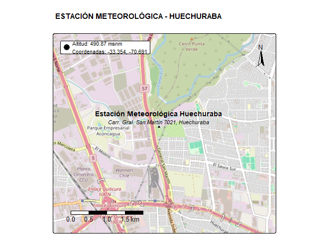

# Ordenamiento y estructuración de datos meteorológicos descargados de dataloggers

Para un proyecto de investigación se instaló una estación meteorológica automática compacta y una serie de sensores que miden los flujos de energia dentro de una parcela de 1000 m-2 en donde se registran las variables cada 60 minutos dentro de un datalogger CR5000. Por cuestiones de seguridad, los datos se descargan semanalmente y estos se van almacenado. El formato de los archivos es ".dat". Para garantizar la integridad y aplicabilidad de los datos, es necesario adjuntarlos de forma secuencial y posteriormente, verificar la calidad; realizar una exploración que integre estadística descriptiva y visualización.

## *Hipótesis*

Asi entonces, se plantea la siguiente hipótesis:

La implementación sistemática de un pipeline integral de procesamiento, visualización y control de calidad de datos es un requisito fundamental para transformar datos meteorológicos crudos en información confiable y aplicable, permitiendo la detección de patrones climáticos significativos y apoyando la toma de decisiones informadas en el manejo agrícola de la parcela.

# Metodología

## **Zona de estudio**

La zona de estudio del proyecto en donde se instaló la estación meteorológica, se encuentra ubicada en Carr. Gral. San Martín 7021, 8, Huechuraba, entre las coordenadas -33.354 de latitud y -70.691 de longitud, a una altitud de 490.87 msnm, Santiago de Chile, Chile.



## Procesamiento de los datos

##Paqueterias utilizadas 

Se usó el entorno de RStudio y los siguientes paquetes: readxl, dplyr, ggplot2, tidyr, lubridate, patchwork, summarytools, officer, flextable, scales, tidyverse, lubridate, readr, writexl. 

### *Variables meteorológicas:*

-   Temperatura (°C)

-   Humedad relativa (%)

-   Velocidad del viento (m/s)

-   Dirección del viento (°)

-   Presión atmosférica (mbar)

-   Radiación global (Wm-2)

-   Precipitación (mm)

### *Variables de flujos de energía:*

-   Temperatura superficial (°C)

-   Flujo de energía en el suelo (Wm-2)

-   Radiación Neta (Wm-2)

-   Temperatura termocupla 1 (°C)

-   Temperatura termocupla 2 (°C)

-   Humedad del suelo a los 5 cm (m3/m3)

-   Humedad del suelo a los 40 cm (m3/m3)

## Consolidar datos

Este paso consiste en importar a R y agrupar los datos en forma secuencial. Para ello se diseñó el siguiente script:

```         
# SCRIPT PARA IMPORTAR Y CONSOLIDAR DATOS DE DATALOGGER \# =====================================================

# 1. CARGAR PAQUETES NECESARIOS

# =============================

library(tidyverse) 
library(lubridate) 
library(readr) 
library(writexl)

# 2. CONFIGURACIÓN INICIAL

# ========================

# Define la ruta de la carpeta donde están los archivos

Parcela1_datos \<- "\~/MEGA/MEGAsync Imports/Doctorado en Chile/Proyecto de doctorado/Instalacion de sensores/Datos y procesamiento/Parcela 3"

# Definir el patrón de nombres de archivo (ajusta según tu caso)

patron_archivos \<- "\\.dat\$" \# Para archivos CSV, cambiar si son .txt, .dat, etc.

# Número de filas a eliminar al inicio de cada archivo

filas_a_eliminar \<- 4

# Nombres de las columnas (AJUSTA SEGÚN TUS DATOS)

nombres_columnas \<- c("TIMESTAMP", "RECORD","SlrFD_W_Avg", "Rain_mm_Tot", "Strikes_Tot", "Dist_km_Avg", "WS_ms_Avg", "WindDir", "MaxWS_ms_Avg", "AirT_C_Avg", "VP_mbar_Avg", "BP_mbar_Avg", "ETos", "Rso", "RH", "RHT_C", "TiltNS_deg_Avg", "TiltWE_deg_Avg", "SlrTF_MJ_Tot", "CVMeta", "Invalid_Wind", "TT_C_Avg", "SBT_C_Avg", "SHF_Avg", "NR_Wm2_Avg", "CNR_Wm2_Avg", "Temp_TC1_C_Avg", "Temp_TC2_C_Avg", "SWC_5CM_Avg", "SWC_40CM_Avg")

# 3. FUNCIÓN PARA IMPORTAR UN ARCHIVO

# ================================================

importar_archivo \<- function(ruta_archivo) { tryCatch({ \# Lee el archivo saltando las primeras 4 filas y ASIGNANDO NOMBRES \# Especificamos que todas las columnas se lean como carácter inicialmente datos \<- read_csv(ruta_archivo, skip = filas_a_eliminar, col_names = nombres_columnas, na = c("", "NA", "NAN"), col_types = cols(.default = col_character()), \# FORZAR todo como carácter locale = locale(encoding = "UTF-8"), show_col_types = FALSE) \# Suprimir mensajes

# Verifica que el archivo no esté vacío después de eliminar las filas
if (nrow(datos) == 0) {
  message("Archivo vacío después de eliminar filas: ", ruta_archivo)
  return(NULL)
}

# Añade columna con el nombre del archivo para trazabilidad
datos$archivo_origen <- basename(ruta_archivo)

cat("Procesado:", basename(ruta_archivo), "- Filas:", nrow(datos), "\n")

return(datos)

}, error = function(e) { message("Error leyendo ", ruta_archivo, ": ", e\$message) return(NULL) }) }

# 4. IDENTIFICAR Y LEER TODOS LOS ARCHIVOS

# ========================================

# Lista todos los archivos que coincidan con el patrón

archivos \<- list.files(Parcela1_datos, pattern = patron_archivos, full.names = TRUE, recursive = FALSE)

cat("Se encontraron", length(archivos), "archivos\n")

# 5. IMPORTAR Y COMBINAR TODOS LOS DATOS

# ======================================

# Lee y combina todos los archivos

datos_completos \<- map_df(archivos, importar_archivo)

print(datos_completos)

# 6. PROCESAR FECHAS Y ORDENAR (SOLO SI HAY DATOS)

# ================================================

if (!is.null(datos_completos) && nrow(datos_completos) \> 0) {

\# Procesar la columna Date que ya existe en los datos datos_completos \<- datos_completos %\>% \# Convertir la columna Date a formato datetime (ajusta el formato según necesites) mutate( fecha_hora = parse_date_time(TIMESTAMP, orders = c("Y-m-d H:M:S")), fecha = as_date(fecha_hora) ) %\>% \# Verificar que las conversiones fueron exitosas filter(!is.na(fecha_hora)) %\>% \# Ordenar cronológicamente por fecha_hora arrange(fecha_hora) %\>% \# Eliminar duplicados por fecha/hora distinct(fecha_hora, .keep_all = TRUE) %\>% \# Reordenar columnas (opcional) select(fecha_hora, fecha, everything(), -TIMESTAMP) \# Elimina la columna Date original si prefieres

\# 7. VERIFICACIÓN Y RESULTADOS \# ============================ cat("\nRESUMEN DEL DATASET COMBINADO:\n") cat("================================\n") cat("Número total de archivos procesados:", length(archivos), "\n") cat("Número total de filas:", nrow(datos_completos), "\n") cat("Número total de columnas:", ncol(datos_completos), "\n") cat("Nombres de columnas:", names(datos_completos), "\n") cat("Rango temporal cubierto:\n") cat(" Desde:", as.character(min(datos_completos$fecha_hora, na.rm = TRUE)), "\n")
  cat("  Hasta:", as.character(max(datos_completos$fecha_hora, na.rm = TRUE)), "\n")

\# Verificar si hay huecos temporales diferencias \<- diff(datos_completos\$fecha_hora) if (length(unique(diferencias)) == 1) { cat("Frecuencia de datos:", unique(diferencias), "\n") } else { cat("¡ADVERTENCIA: Frecuencia de datos irregular!\n") cat("Diferencias encontradas:", paste(unique(diferencias), collapse = ", "), "\n") } }

# 11. LIMPIAR VARIABLES TEMPORALES

# ================================

rm(archivos, importar_archivo, filas_a_eliminar, nombres_columnas)

#Exportamos los datos#

write_xlsx(datos_completos, "Datos_Parcela_3.xlsx") 
```

## **Análisis Estadístico**

El análisis estadístico que se realizó consistió en un proceso exploratorio integral que comenzó con la carga y transformación de los datos, convirtiendo las variables a formato numérico y renombrando las columnas a un esquema en español para mayor claridad. Se calcularon estadísticas descriptivas fundamentales —como la media, mediana, desviación estándar, valores mínimo y máximo, y el conteo de valores faltantes— para las variables meteorológicas principales, entre las que se incluyeron la temperatura del aire, la humedad relativa, la velocidad del viento y la radiación global. Este análisis inicial proporcionó un resumen ejecutivo del período de datos, incluyendo las fechas de inicio y fin, la duración total en días y el número total de registros, sentando las bases para una comprensión cuantitativa del conjunto de datos antes de proceder con evaluaciones más profundas.

## **Visualización**

La visualización de datos se llevó a cabo mediante la generación de una serie de gráficos estáticos diseñados para revelar patrones temporales y distribucionales. Se crearon paneles de series de tiempo que mostraron la evolución de variables atmosféricas (como radiación, viento y temperatura) y variables del suelo (como temperatura superficial y humedad a diferentes profundidades) a lo largo del tiempo. Además, se generó un boxplot para comparar la distribución de las diferentes temperaturas medidas, resaltando valores atípicos, y un gráfico circular o de rosa de los vientos para visualizar la dirección predominante del viento, agrupando los datos en sectores (N, NE, E, etc.). Estas visualizaciones se guardaron en archivos de imagen de alta calidad y se integraron automáticamente en el informe final.

## **Control de Calidad**

El control de calidad fue un proceso riguroso y automatizado que se aplicó para garantizar la integridad de los datos. Este proceso se compuso de varias verificaciones explícitas: 

**1) Verificación de rangos físicos plausibles:** Se definieron y evaluaron límites físicos para cada variable (por ejemplo, la humedad relativa debía estar entre 0% y 100%, y la radiación global entre 0 y 1500 W/m²), contabilizando todos los valores que se encontraron fuera de estos intervalos. 

**2) Detección de valores atípicos estadísticos:** Se utilizó el método del rango intercuartílico (IQR) para identificar observaciones atípicas en variables clave, calculando el número y porcentaje de estos valores que se desviaron significativamente de la distribución central. 

**3) Evaluación de la completitud:** Se calculó el porcentaje de datos no faltantes para las variables esenciales, lo que permitió identificar cuáles pudieron tener problemas de disponibilidad. 

**4) Control de la continuidad temporal:** Se detectaron saltos en la serie temporal identificando intervalos entre registros consecutivos que no fueron de una hora, lo que ayudó a encontrar huecos o inconsistencias en la frecuencia del muestreo.

Los resultados de todas estas pruebas se reportaron detalladamente dentro un informe informe final. El script a continuación: 

```
#Análisis estadístico y control de calidad

# CARGAR LIBRERÍAS NECESARIAS

install.packages(c("officer","flextable","scales"))
library(readxl)
library(dplyr)
library(ggplot2)
library(tidyr)
library(lubridate)
library(patchwork)
library(summarytools)
library(officer)
library(flextable)
library(scales)

# CONFIGURAR OPCIONES
options(warn = -1, scipen = 999)
theme_set(theme_bw())

# =============================================================================
# FUNCIÓN PRINCIPAL COMPLETA
# =============================================================================

procesar_datos_completo <- function(archivo, prefijo = "Analisis_Parcela3", archivo_word = "Informe_Analisis_Parcela3.docx") {
  
  # Cargar datos
  cat("Cargando datos desde:", archivo, "\n")
  df <- read_excel(archivo)
  
  # ---------------------------
  # 1. PROCESAR Y RENOMBRAR
  # ---------------------------
  procesar_variables <- function(datos) {
    cat("\n1. PROCESANDO Y RENOMBRANDO VARIABLES...\n")
    
    # Convertir a numérico columnas habituales si existen
    columnas_numericas <- c(
      "SlrFD_W_Avg", "Rain_mm_Tot", "Strikes_Tot", "Dist_km_Avg", "WS_ms_Avg",
      "WindDir", "MaxWS_ms_Avg", "AirT_C_Avg", "VP_mbar_Avg", "BP_mbar_Avg",
      "ETos", "Rso", "RH", "RHT_C", "TiltNS_deg_Avg", "TiltWE_deg_Avg",
      "SlrTF_MJ_Tot", "Invalid_Wind", "TT_C_Avg", "SBT_C_Avg", "SHF_Avg",
      "NR_Wm2_Avg", "CNR_Wm2_Avg", "Temp_TC1_C_Avg", "Temp_TC2_C_Avg",
      "SWC_5CM_Avg", "SWC_40CM_Avg", "WS_ms_Avg"
    )
    
    for (col in columnas_numericas) {
      if (col %in% colnames(datos)) {
        datos[[col]] <- as.numeric(datos[[col]])
      }
    }
    
    # Renombrar variables conocidas a español (mantener otras columnas)
    nombres_espanol <- c(
      "SlrFD_W_Avg" = "Radiacion_global_Wm2",
      "Rain_mm_Tot" = "Precipitacion_mm", 
      "Strikes_Tot" = "Rayos_conteo",
      "WS_ms_Avg" = "Velocidad_viento_ms",
      "WindDir" = "Direccion_viento_grados",
      "MaxWS_ms_Avg" = "Rachas_ms",
      "AirT_C_Avg" = "Temperatura_aire_C",
      "BP_mbar_Avg" = "Presion_atmosferica_mbar",
      "RH" = "Humedad_relativa_porc",
      "SlrTF_MJ_Tot" = "Radiacion_global_MJm2",
      "SBT_C_Avg" = "Temperatura_superficie_C",
      "SHF_Avg" = "Flujo_energia_suelo_Wm2",
      "NR_Wm2_Avg" = "Radiacion_neta_Wm2",
      "Temp_TC1_C_Avg" = "Temperatura_termocupla1_C",
      "Temp_TC2_C_Avg" = "Temperatura_termocupla2_C",
      "SWC_5CM_Avg" = "Humedad_suelo_5cm_m3m3",
      "SWC_40CM_Avg" = "Humedad_suelo_40cm_m3m3"
    )
    
    for (viejo_nombre in names(nombres_espanol)) {
      if (viejo_nombre %in% colnames(datos)) {
        names(datos)[names(datos) == viejo_nombre] <- nombres_espanol[[viejo_nombre]]
      }
    }
    
    # Asegurarse de tener columna de fecha_hora (intentar detectar)
    if (!("fecha_hora" %in% names(datos))) {
      if ("fecha" %in% names(datos) & "hora" %in% names(datos)) {
        datos <- datos %>%
          mutate(fecha_hora = as.POSIXct(paste(as.character(fecha), as.character(hora)), tz = "UTC"))
      } else if ("fecha" %in% names(datos)) {
        # si 'fecha' contiene fecha+hora
        datos <- datos %>% mutate(fecha_hora = as.POSIXct(fecha))
      } else {
        warning("No se encontró columna de fecha. Asegúrate de tener 'fecha' o 'fecha_hora'.")
      }
    } else {
      datos <- datos %>% mutate(fecha_hora = as.POSIXct(fecha_hora))
    }
    
    cat("✓ Variables convertidas y renombradas\n")
    return(datos)
  }
  
  # ---------------------------
  # 2. ANÁLISIS EXPLORATORIO
  # ---------------------------
  analisis_exploratorio <- function(datos) {
    cat("\n2. REALIZANDO ANÁLISIS EXPLORATORIO...\n")
    
    resultados_ae <- list()
    
    # Información básica (proteger si fecha_hora NA)
    fecha_min <- ifelse(all(is.na(datos$fecha_hora)), NA, min(datos$fecha_hora, na.rm = TRUE))
    fecha_max <- ifelse(all(is.na(datos$fecha_hora)), NA, max(datos$fecha_hora, na.rm = TRUE))
    duracion <- ifelse(is.na(fecha_min) | is.na(fecha_max), NA, as.numeric(difftime(fecha_max, fecha_min, units = "days")))
    
    resultados_ae$info_basica <- list(
      n_filas = nrow(datos),
      n_columnas = ncol(datos),
      fecha_inicio = fecha_min,
      fecha_fin = fecha_max,
      duracion = duracion
    )
    
    # Variables numéricas disponibles
    vars_numericas <- datos %>% select(where(is.numeric)) %>% colnames()
    resultados_ae$variables_numericas <- vars_numericas
    
    # Estadísticas descriptivas (variables principales si existen)
    vars_principales <- c("Temperatura_aire_C", "Humedad_relativa_porc", "Velocidad_viento_ms",
                          "Radiacion_global_Wm2", "Presion_atmosferica_mbar", "Precipitacion_mm")
    
    estadisticas <- list()
    for (var in vars_principales) {
      if (var %in% colnames(datos)) {
        estadisticas[[var]] <- list(
          media = mean(datos[[var]], na.rm = TRUE),
          mediana = median(datos[[var]], na.rm = TRUE),
          desviacion = sd(datos[[var]], na.rm = TRUE),
          min = min(datos[[var]], na.rm = TRUE),
          max = max(datos[[var]], na.rm = TRUE),
          nas = sum(is.na(datos[[var]]))
        )
      }
    }
    resultados_ae$estadisticas <- estadisticas
    
    # Valores faltantes
    na_count <- colSums(is.na(datos))
    resultados_ae$valores_faltantes <- na_count[na_count > 0]
    
    cat("✓ Análisis exploratorio completado\n")
    return(resultados_ae)
  }
  
  # ---------------------------
  # 3. VISUALIZACIONES + viento
  # ---------------------------
  crear_visualizaciones <- function(datos) {
    cat("\n3. CREANDO VISUALIZACIONES...\n")
    
    # Asegurar columna de fecha_hora ordenada
    datos <- datos %>% arrange(fecha_hora)
    
    # PANEL ATMOSFÉRICO (igual que antes)
    p1 <- if ("Radiacion_global_Wm2" %in% colnames(datos)) {
      ggplot(datos, aes(x = fecha_hora, y = Radiacion_global_Wm2)) +
        geom_line(color = "orange", alpha = 0.7, linewidth = 0.3) +
        labs(title = "Radiación Global", x = "", y = "W/m²")
    } else NULL
    
    p2 <- if ("Velocidad_viento_ms" %in% colnames(datos)) {
      ggplot(datos, aes(x = fecha_hora, y = Velocidad_viento_ms)) +
        geom_line(color = "blue", alpha = 0.7, linewidth = 0.3) +
        labs(title = "Velocidad del Viento", x = "", y = "m/s")
    } else NULL
    
    p3 <- if ("Rachas_ms" %in% colnames(datos)) {
      ggplot(datos, aes(x = fecha_hora, y = Rachas_ms)) +
        geom_line(color = "darkblue", alpha = 0.7, linewidth = 0.3) +
        labs(title = "Rachas", x = "", y = "m/s")
    } else NULL
    
    p4 <- if ("Temperatura_aire_C" %in% colnames(datos)) {
      ggplot(datos, aes(x = fecha_hora, y = Temperatura_aire_C)) +
        geom_line(color = "red", alpha = 0.7, linewidth = 0.3) +
        labs(title = "Temperatura del Aire", x = "", y = "°C")
    } else NULL
    
    p5 <- if ("Humedad_relativa_porc" %in% colnames(datos)) {
      ggplot(datos, aes(x = fecha_hora, y = Humedad_relativa_porc)) +
        geom_line(color = "darkgreen", alpha = 0.7, linewidth = 0.3) +
        labs(title = "Humedad Relativa", x = "Fecha", y = "%")
    } else NULL
    
    # Organizar panel atmosférico
    # intentar combinar solo los plots no-NULL
    atm_plots <- list(p1,p2,p3,p4,p5)
    atm_plots <- atm_plots[!sapply(atm_plots, is.null)]
    
    if (length(atm_plots) > 0) {
      # crear layout flexible: 3 columnas por fila
      if (length(atm_plots) <= 3) {
        panel_atmosferico <- wrap_plots(atm_plots, ncol = length(atm_plots)) +
          plot_annotation(title = "Variables Atmosféricas - Series Temporales")
      } else {
        panel_atmosferico <- (wrap_plots(atm_plots[1:3], ncol = 3) /
                                wrap_plots(atm_plots[4:length(atm_plots)], ncol = 3)) +
          plot_annotation(title = "Variables Atmosféricas - Series Temporales")
      }
    } else {
      panel_atmosferico <- NULL
    }
    
    # PANEL SUELO (igual lógica)
    suelo_plots <- list()
    if ("Temperatura_superficie_C" %in% colnames(datos)) {
      suelo_plots[[length(suelo_plots)+1]] <- ggplot(datos, aes(x = fecha_hora, y = Temperatura_superficie_C)) +
        geom_line(color = "darkred", alpha = 0.7, linewidth = 0.3) + labs(title = "Temperatura Superficie", x = "", y = "°C")
    }
    if ("Flujo_energia_suelo_Wm2" %in% colnames(datos)) {
      suelo_plots[[length(suelo_plots)+1]] <- ggplot(datos, aes(x = fecha_hora, y = Flujo_energia_suelo_Wm2)) +
        geom_line(color = "darkorange", alpha = 0.7, linewidth = 0.3) + labs(title = "Flujo Energía Suelo", x = "", y = "W/m²")
    }
    if ("Temperatura_termocupla1_C" %in% colnames(datos)) {
      suelo_plots[[length(suelo_plots)+1]] <- ggplot(datos, aes(x = fecha_hora, y = Temperatura_termocupla1_C)) +
        geom_line(color = "#FF6A6A", alpha = 0.7, linewidth = 0.3) + labs(title = "Termocupla 1", x = "", y = "°C")
    }
    if ("Temperatura_termocupla2_C" %in% colnames(datos)) {
      suelo_plots[[length(suelo_plots)+1]] <- ggplot(datos, aes(x = fecha_hora, y = Temperatura_termocupla2_C)) +
        geom_line(color = "#CD5555", alpha = 0.7, linewidth = 0.3) + labs(title = "Termocupla 2", x = "", y = "°C")
    }
    if ("Humedad_suelo_5cm_m3m3" %in% colnames(datos)) {
      suelo_plots[[length(suelo_plots)+1]] <- ggplot(datos, aes(x = fecha_hora, y = Humedad_suelo_5cm_m3m3)) +
        geom_line(color = "darkolivegreen", alpha = 0.7, linewidth = 0.3) + labs(title = "Humedad Suelo 5cm", x = "", y = "m³/m³")
    }
    if ("Humedad_suelo_40cm_m3m3" %in% colnames(datos)) {
      suelo_plots[[length(suelo_plots)+1]] <- ggplot(datos, aes(x = fecha_hora, y = Humedad_suelo_40cm_m3m3)) +
        geom_line(color = "darkolivegreen4", alpha = 0.7, linewidth = 0.3) + labs(title = "Humedad Suelo 40cm", x = "Fecha", y = "m³/m³")
    }
    
    if (length(suelo_plots) > 0) {
      panel_suelo <- wrap_plots(suelo_plots, ncol = 3) +
        plot_annotation(title = "Variables del Suelo - Series Temporales")
    } else {
      panel_suelo <- NULL
    }
    
    # BOXPLOT de temperaturas (igual que antes)
    temp_vars <- c("Temperatura_aire_C", "Temperatura_superficie_C", 
                   "Temperatura_termocupla1_C", "Temperatura_termocupla2_C")
    temp_disponibles <- temp_vars[temp_vars %in% colnames(datos)]
    if (length(temp_disponibles) > 0) {
      datos_temp <- datos %>%
        select(all_of(temp_disponibles)) %>%
        pivot_longer(cols = everything(), names_to = "Variable", values_to = "Valor")
      etiquetas <- c(
        "Temperatura_aire_C" = "Temp Aire",
        "Temperatura_superficie_C" = "Temp Superficie", 
        "Temperatura_termocupla1_C" = "Termocupla 1",
        "Temperatura_termocupla2_C" = "Termocupla 2"
      )
      datos_temp$Variable_etiqueta <- factor(datos_temp$Variable,
                                             levels = names(etiquetas),
                                             labels = etiquetas)
      boxplot_temperaturas <- ggplot(datos_temp, aes(x = Variable_etiqueta, y = Valor, fill = Variable_etiqueta)) +
        geom_boxplot(outlier.color = "red", outlier.shape = 16, outlier.size = 1.2) +
        stat_summary(fun = mean, geom = "point", shape = 18, size = 3, color = "yellow") +
        labs(title = "Distribución de Temperaturas - Boxplot", x = "Variables", y = "°C") +
        theme(legend.position = "none", axis.text.x = element_text(angle = 45, hjust = 1))
    } else {
      boxplot_temperaturas <- NULL
    }
    
    # -------------------------------------------------------
    # GRÁFICO ADICIONAL: DIRECCIÓN DE VIENTO PREDOMINANTE
    # -------------------------------------------------------
    cat("Creando gráfico de dirección de viento predominante...\n")
    
    if ("Direccion_viento_grados" %in% colnames(datos)) {
      
      # Definir sectores (8 puntos cardinales)
      datos$sector_viento <- cut(
        datos$Direccion_viento_grados,
        breaks = seq(0, 360, by = 45),
        include.lowest = TRUE,
        labels = c("N","NE","E","SE","S","SO","O","NO")
      )
      
      # Contar frecuencia por sector
      tabla_viento <- datos %>%
        group_by(sector_viento) %>%
        summarise(frecuencia = n()) %>%
        mutate(porcentaje = frecuencia / sum(frecuencia) * 100)
      
      # Gráfico tipo rosa (pero circular simple)
      grafico_viento <- ggplot(tabla_viento, aes(x = sector_viento, y = porcentaje, fill = sector_viento)) +
        geom_col(color = "black") +
        coord_polar(start = -pi/8) +
        labs(title = "Dirección de Viento Predominante",
             x = "",
             y = "Porcentaje (%)") +
        theme_minimal() +
        theme(plot.title = element_text(hjust = 0.5, face = "bold"))
      
    } else {
      grafico_viento <- NULL
    }
    return(list(
      panel_atmosferico = panel_atmosferico,
      panel_suelo = panel_suelo,
      boxplot_temperaturas = boxplot_temperaturas,
      rosa_viento = grafico_viento
    ))
  }
  
  # ---------------------------
  # 4. CONTROL DE CALIDAD
  # ---------------------------
  control_calidad <- function(datos) {
    cat("\n4. REALIZANDO CONTROL DE CALIDAD...\n")
    
    resultados_cc <- list()
    
    limites <- list(
      Temperatura_aire_C = c(-10, 45),
      Humedad_relativa_porc = c(0, 100),
      Velocidad_viento_ms = c(0, 50),
      Radiacion_global_Wm2 = c(0, 1500),
      Precipitacion_mm = c(0, 100),
      Humedad_suelo_5cm_m3m3 = c(0, 0.6),
      Humedad_suelo_40cm_m3m3 = c(0, 0.6)
    )
    
    fuera_rango <- list()
    for (var in names(limites)) {
      if (var %in% colnames(datos)) {
        idx <- which(datos[[var]] < limites[[var]][1] | datos[[var]] > limites[[var]][2])
        fuera_rango[[var]] <- list(
          n_fuera_rango = length(idx),
          porcentaje = round(length(idx) / nrow(datos) * 100, 2)
        )
      }
    }
    resultados_cc$fuera_rango <- fuera_rango
    
    # Atípicos IQR
    atipicos_iqr <- list()
    variables_verificar <- c("Temperatura_aire_C", "Humedad_relativa_porc", 
                             "Velocidad_viento_ms", "Radiacion_global_Wm2")
    for (var in variables_verificar) {
      if (var %in% colnames(datos)) {
        Q1 <- quantile(datos[[var]], 0.25, na.rm = TRUE)
        Q3 <- quantile(datos[[var]], 0.75, na.rm = TRUE)
        IQR_val <- Q3 - Q1
        lower_bound <- Q1 - 1.5 * IQR_val
        upper_bound <- Q3 + 1.5 * IQR_val
        idx_atipicos <- which(datos[[var]] < lower_bound | datos[[var]] > upper_bound)
        atipicos_iqr[[var]] <- list(
          n_atipicos = length(idx_atipicos),
          porcentaje = round(length(idx_atipicos) / nrow(datos) * 100, 2)
        )
      }
    }
    resultados_cc$atipicos_iqr <- atipicos_iqr
    
    vars_esenciales <- c("Temperatura_aire_C", "Humedad_relativa_porc", 
                         "Velocidad_viento_ms", "Radiacion_global_Wm2")
    completitud <- sapply(vars_esenciales, function(x) {
      if (x %in% colnames(datos)) {
        round(sum(!is.na(datos[[x]])) / nrow(datos) * 100, 2)
      } else {
        NA
      }
    })
    resultados_cc$completitud <- completitud
    
    datos2 <- datos %>% mutate(diff_tiempo = as.numeric(difftime(fecha_hora, lag(fecha_hora), units = "hours")))
    saltos_tiempo <- which(datos2$diff_tiempo != 1 & !is.na(datos2$diff_tiempo))
    resultados_cc$saltos_temporales <- length(saltos_tiempo)
    
    cat("✓ Control de calidad completado\n")
    return(resultados_cc)
  }
  
  # ---------------------------
  # 5. GENERAR INFORME EN WORD
  # ---------------------------
  generar_informe_word <- function(datos, resultados_ae, resultados_cc, graficos, prefijo, archivo_word) {
    cat("\n5. GENERANDO INFORME EN WORD...\n")
    
    # Guardar gráficos a disco para luego incrustar
    if (!is.null(graficos$panel_atmosferico)) {
      png1 <- paste0(prefijo, "_Panel_Atmosferico.png")
      ggsave(png1, graficos$panel_atmosferico, width = 14, height = 10, dpi = 300)
    } else png1 <- NULL
    
    if (!is.null(graficos$panel_suelo)) {
      png2 <- paste0(prefijo, "_Panel_Suelo.png")
      ggsave(png2, graficos$panel_suelo, width = 14, height = 10, dpi = 300)
    } else png2 <- NULL
    
    if (!is.null(graficos$boxplot_temperaturas)) {
      png3 <- paste0(prefijo, "_Boxplot_Temperaturas.png")
      ggsave(png3, graficos$boxplot_temperaturas, width = 10, height = 8, dpi = 300)
    } else png3 <- NULL
    
    if (!is.null(graficos$grafico_direccion_viento)) {
      png4 <- paste0(prefijo, "_Direccion_Viento.png")
      ggsave(png4, graficos$grafico_direccion_viento, width = 7, height = 7, dpi = 300)
    } else png4 <- NULL
    
    # Crear documento Word
    doc <- read_docx()
    doc <- doc %>% 
      body_add_par("Informe - Análisis de Datos Meteorológicos", style = "heading 1") %>%
      body_add_par(paste0("Fecha de generación: ", Sys.Date()), style = "Normal")
    
    # Resumen ejecutivo
    doc <- doc %>% body_add_par("Resumen ejecutivo", style = "heading 2")
    resumen_txt <- c(
      paste0("- Periodo analizado: ", as.character(resultados_ae$info_basica$fecha_inicio), " a ", as.character(resultados_ae$info_basica$fecha_fin)),
      paste0("- Duración (días): ", round(resultados_ae$info_basica$duracion, 1)),
      paste0("- Total registros: ", resultados_ae$info_basica$n_filas),
      paste0("- Variables numéricas analizadas: ", paste(resultados_ae$variables_numericas, collapse = ", "))
    )
    doc <- doc %>% body_add_par(paste(resumen_txt, collapse = "\n"), style = "Normal")
    
    # Estadísticas principales: convertir a data.frame y agregar
    if (length(resultados_ae$estadisticas) > 0) {
      stats_df <- do.call(rbind, lapply(names(resultados_ae$estadisticas), function(x) {
        s <- resultados_ae$estadisticas[[x]]
        data.frame(Variable = x, Media = round(s$media,3), Mediana = round(s$mediana,3),
                   SD = round(s$desviacion,3), Min = round(s$min,3), Max = round(s$max,3), NA_count = s$nas, stringsAsFactors = FALSE)
      }))
      stats_ft <- regulartable(stats_df)
      stats_ft <- autofit(stats_ft)
      doc <- doc %>% body_add_par("Estadísticas descriptivas (variables seleccionadas)", style = "heading 2")
      doc <- doc %>% body_add_flextable(stats_ft)
    }
    
    # Control de calidad: fuera de rango
    doc <- doc %>% body_add_par("Control de calidad - resumen", style = "heading 2")
    # fuera_rango table
    fuera_rango_df <- do.call(rbind, lapply(names(resultados_cc$fuera_rango), function(x) {
      v <- resultados_cc$fuera_rango[[x]]
      data.frame(Variable = x, N_fuera_rango = v$n_fuera_rango, Porcentaje = v$porcentaje, stringsAsFactors = FALSE)
    }))
    fr_ft <- regulartable(fuera_rango_df)
    fr_ft <- autofit(fr_ft)
    doc <- doc %>% body_add_par("Valores fuera de rango físico (conteo y %):", style = "Normal")
    doc <- doc %>% body_add_flextable(fr_ft)
    
    # atipicos table
    atipicos_df <- do.call(rbind, lapply(names(resultados_cc$atipicos_iqr), function(x) {
      v <- resultados_cc$atipicos_iqr[[x]]
      data.frame(Variable = x, N_atipicos = v$n_atipicos, Porcentaje = v$porcentaje, stringsAsFactors = FALSE)
    }))
    at_ft <- regulartable(atipicos_df)
    at_ft <- autofit(at_ft)
    doc <- doc %>% body_add_par("Valores atípicos (IQR):", style = "Normal")
    doc <- doc %>% body_add_flextable(at_ft)
    
    # completitud
    comp_df <- data.frame(Variable = names(resultados_cc$completitud), Completitud_pct = as.vector(resultados_cc$completitud))
    comp_ft <- regulartable(comp_df)
    comp_ft <- autofit(comp_ft)
    doc <- doc %>% body_add_par("Completitud de datos (%):", style = "Normal")
    doc <- doc %>% body_add_flextable(comp_ft)
    
    # Saltos temporales
    doc <- doc %>% body_add_par(paste0("Saltos en la serie temporal (intervalos != 1 hora): ", resultados_cc$saltos_temporales), style = "Normal")
    
    # Insertar gráficos
    doc <- doc %>% body_add_par("Gráficos generados", style = "heading 2")
    if (!is.null(png1)) doc <- doc %>% body_add_par("Panel Atmosférico") %>% body_add_img(src = png1, width = 6.5, height = 4.5)
    if (!is.null(png2)) doc <- doc %>% body_add_par("Panel Suelo") %>% body_add_img(src = png2, width = 6.5, height = 4.5)
    if (!is.null(png3)) doc <- doc %>% body_add_par("Boxplot de Temperaturas") %>% body_add_img(src = png3, width = 6.5, height = 4.5)
    if (!is.null(png4)) {
      doc <- doc %>% body_add_par("Dirección de Viento (sectores)") %>% body_add_img(src = png4, width = 5, height = 5)
      # agregar tabla de sectores
      dir_tab <- graficos$direccion_resumen$tabla
      dir_tab <- dir_tab %>% mutate(freq = round(freq,2))
      dir_ft <- regulartable(dir_tab)
      dir_ft <- autofit(dir_ft)
      doc <- doc %>% body_add_par("Tabla de frecuencia por sector (Dirección de viento)", style = "Normal") %>% body_add_flextable(dir_ft)
      # insertar predominante
      pred <- graficos$direccion_resumen$predominante
      doc <- doc %>% body_add_par(paste0("Dirección predominante: ", pred$sector, " (", pred$n, " observaciones, ", round(pred$n/sum(dir_tab$n)*100,2), "%)"), style = "Normal")
    }
    
    # Recomendaciones (breves)
    doc <- doc %>% body_add_par("Recomendaciones (generales)", style = "heading 2")
    recs <- c(
      "Revisar valores fuera de rango y su origen (sensores, errores de registro).",
      "Investigar valores atípicos y decidir imputación o descarte.",
      paste0("Mejorar completitud si alguna variable crítica < 90% (completitud mínima observada: ", min(resultados_cc$completitud, na.rm = TRUE), "%)."),
      "Verificar sincronización temporal entre sensores si hay saltos significativos."
    )
    doc <- doc %>% body_add_par(paste("- ", recs, collapse = "\n"), style = "Normal")
    
    # Guardar docx
    print(doc, target = archivo_word)
    cat("✓ Documento Word generado en:", archivo_word, "\n")
    
    # retornar nombres de archivos generados
    lista_guardados <- list(png_panel_atm = png1, png_panel_suelo = png2, png_boxplot = png3, png_viento = png4, doc = archivo_word)
    return(lista_guardados)
  }
  
  # ---------------------------
  # EJECUTAR PIPELINE COMPLETO
  # ---------------------------
  cat("INICIANDO PROCESAMIENTO COMPLETO DE DATOS...\n")
  datos_procesados <- procesar_variables(df)
  resultados_ae <- analisis_exploratorio(datos_procesados)
  graficos <- crear_visualizaciones(datos_procesados)
  resultados_cc <- control_calidad(datos_procesados)
  
  # imprimir informe en consola
  generar_informe <- function(datos, resultados_ae, resultados_cc, graficos) {
    # (reusar tu función de consola si quisieras; ya no necesario aquí)
    cat("Resumen en consola disponible.\n")
  }
  generar_informe(datos_procesados, resultados_ae, resultados_cc, graficos)
  
  # Mostrar y guardar gráficos
  cat("\nMOSTRANDO Y GUARDANDO GRÁFICOS...\n")
  if (!is.null(graficos$panel_atmosferico)) print(graficos$panel_atmosferico)
  if (!is.null(graficos$panel_suelo)) print(graficos$panel_suelo)
  if (!is.null(graficos$boxplot_temperaturas)) print(graficos$boxplot_temperaturas)
  if (!is.null(graficos$grafico_direccion_viento)) print(graficos$grafico_direccion_viento)
  
  # Guardar resultados a disco (datos, resumen txt)
  write.csv(datos_procesados, paste0(prefijo, "_Datos_Procesados.csv"), row.names = FALSE, fileEncoding = "UTF-8")
  
  # Generar Word con todo
  archivos_generados <- generar_informe_word(datos_procesados, resultados_ae, resultados_cc, graficos, prefijo, archivo_word)
  
  # devolver todo
  return(list(
    datos_procesados = datos_procesados,
    analisis_exploratorio = resultados_ae,
    control_calidad = resultados_cc,
    graficos = graficos,
    archivos_generados = archivos_generados
  ))
}

# =============================================================================
# EJECUTAR ANÁLISIS COMPLETO (EJEMPLO)
# =============================================================================

# Sustituye "Datos_Parcela_3.xlsx" por tu archivo real.
# El informe Word se guardará como "Informe_Analisis_Parcela3.docx"
resultados_completos <- procesar_datos_completo("Datos_Parcela_3.xlsx",
                                                prefijo = "Analisis_Parcela3",
                                                archivo_word = "Informe_Analisis_Parcela3.docx")

```
