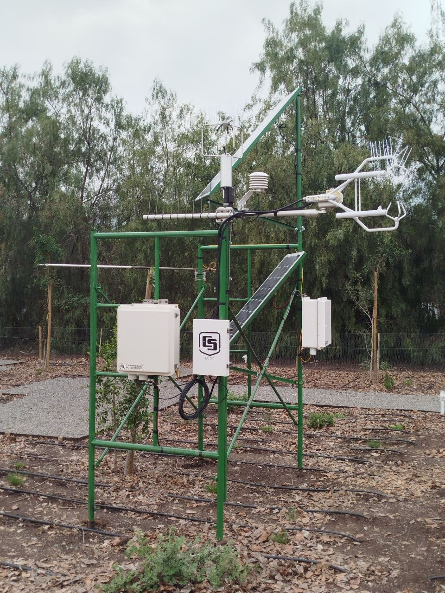
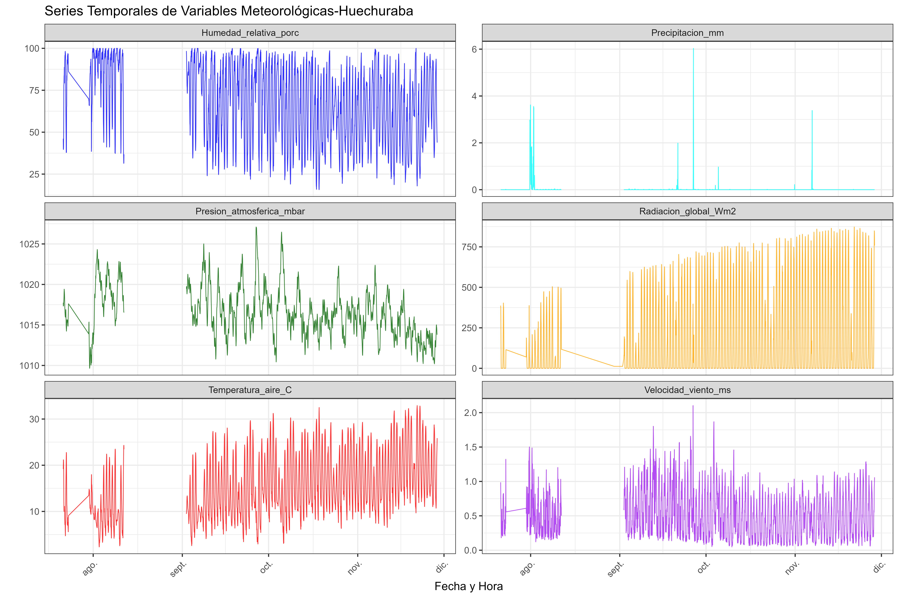
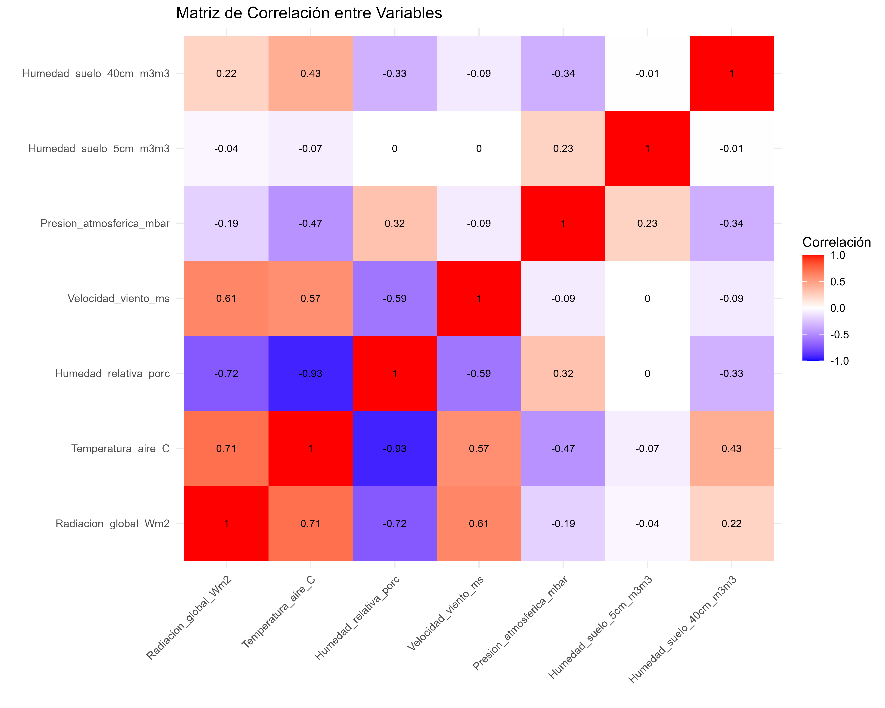
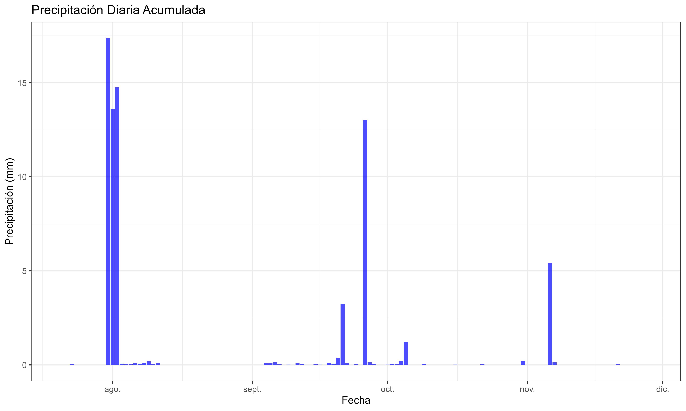
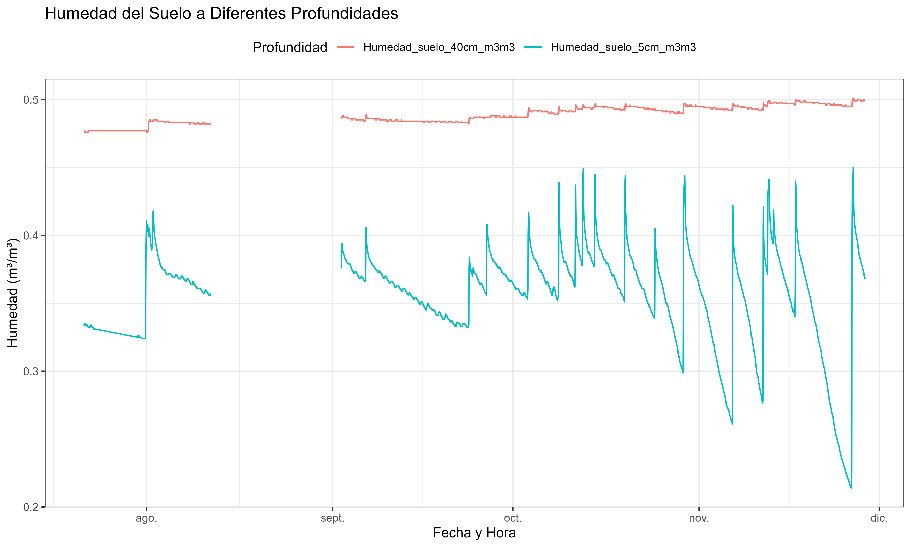
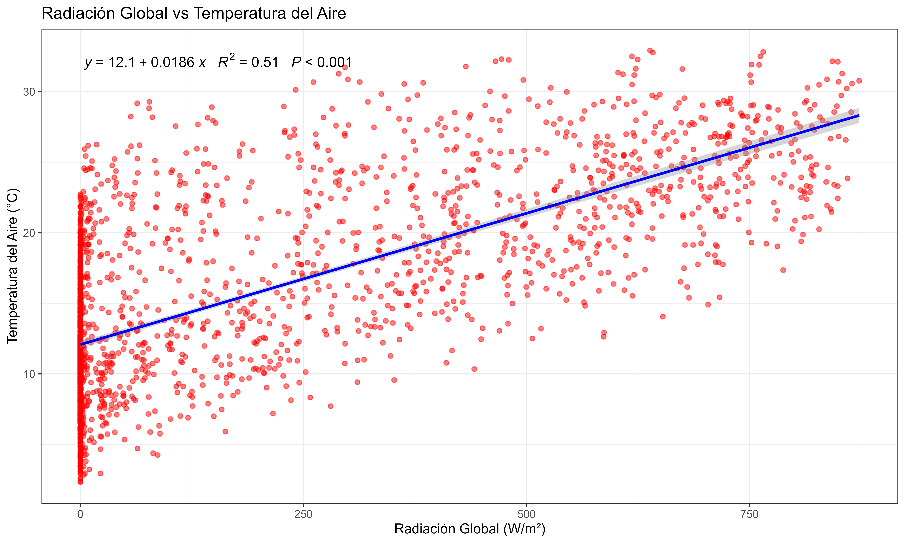
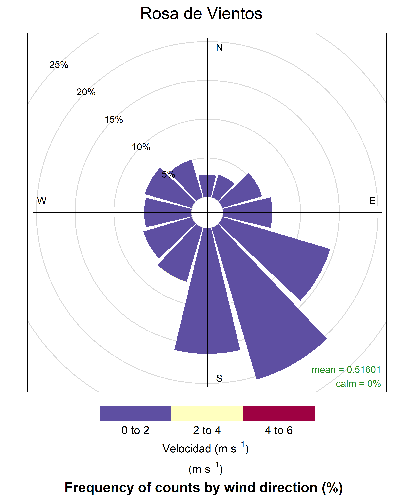
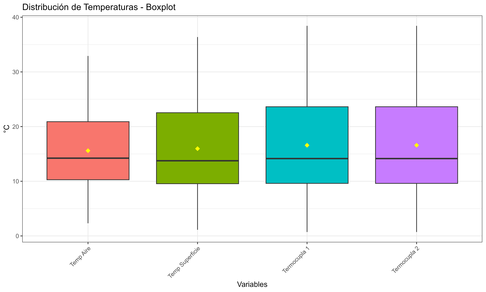

# Ordenamiento y estructuración de datos meteorológicos descargados de dataloggers

Para un proyecto de investigación se instaló una estación meteorológica automática compacta y una serie de sensores que miden los flujos de energia dentro de una parcela de 1000 m-2 en donde se registran las variables cada 60 minutos dentro de un datalogger CR5000. Por cuestiones de seguridad, los datos se descargan semanalmente y estos se van almacenado. El formato de los archivos es ".dat". Para garantizar la integridad y aplicabilidad de los datos, es necesario adjuntarlos de forma secuencial y posteriormente, verificar la calidad; realizar una exploración que integre estadística descriptiva y visualización.



## *Objetivo*

Implementar un pipeline integral de procesamiento, visualización y control de calidad de datos para transformar datos meteorológicos crudos en información confiable y aplicable.

## **Zona de estudio**

La zona de estudio del proyecto en donde se instaló la estación meteorológica, se encuentra ubicada en Carr. Gral. San Martín 7021, 8, Huechuraba, entre las coordenadas -33.354 de latitud y -70.691 de longitud, a una altitud de 490.87 msnm, Santiago de Chile, Chile.


Este visualización de la localización de la zona de estudio se realizó con el siguiente script:

```         
library(tmap)
library(sf)
library(dplyr)

# Crear un objeto espacial con toda la información
estacion <- data.frame(
  nombre = "Estación Meteorológica Huechuraba",
  direccion = "Carr. Gral. San Martín 7021, Huechuraba",
  altitud = "490.87 msnm",
  coordenadas = "-33.354, -70.691",
  lat = -33.354,
  lon = -70.691
) %>%
  st_as_sf(coords = c("lon", "lat"), crs = 4326)

# Definir el área de visualización (zoom más cercano)
bbox_area <- st_bbox(c(xmin = -70.71, xmax = -70.67, 
                       ymin = -33.37, ymax = -33.34))

# Crear el mapa con toda la información
tm <- tm_shape(estacion, bbox = bbox_area) +
  # Mapa base
  tm_basemap("OpenStreetMap") +
  
  # Punto de la estación
  tm_dots(size = 0.3, 
          col = "red", 
          shape = 17,
          title = "Ubicación Estación",
          legend.show = FALSE) +
  
  # Etiqueta con el nombre
  tm_text("nombre", 
          ymod = 1.2, 
          size = 0.9, 
          fontface = "bold",
          shadow = TRUE) +
  
  # Información adicional como etiqueta
  tm_text("direccion",
          ymod = 0.6,
          size = 0.7,
          fontface = "italic") +
  
  # Elementos cartográficos
  tm_scale_bar(position = c("left", "bottom"),
               text.size = 0.8) +
  tm_compass(position = c("right", "top"),
             size = 2) +
  
  # Título y diseño
  tm_layout(
    main.title = "ESTACIÓN METEOROLÓGICA - HUECHURABA",
    main.title.size = 1.1,
    main.title.fontface = "bold",
    main.title.position = "center",
    frame = TRUE,
    bg.color = "white"
  ) +
  
  # Leyenda personalizada con la información
  tm_add_legend(type = "symbol",
                labels = paste("Altitud: 490.87 msnm\nCoordenadas: -33.354, -70.691"),
                col = "black",
                size = 0.8,
                fontface = "bold",
                position = c("left", "top"))

tm

# Guardar el mapa
tmap_save(tm, "area.png", width = 10, height = 8, dpi = 300)

```

## Procesamiento de los datos

### Paqueterías utilizadas

Se usó el entorno de RStudio y los siguientes paquetes: `readxl`, `dplyr`, `ggplot2`, `tidyr`, `lubridate`, `patchwork`, `summarytools`, `officer`, `flextable`, `scales`, `tidyverse`, `lubridate`, `readr` y `writexl`.

### *Variables meteorológicas:*

-   Temperatura (°C)

-   Humedad relativa (%)

-   Velocidad del viento (m/s)

-   Dirección del viento (°)

-   Presión atmosférica (mbar)

-   Radiación global (Wm-2)

-   Precipitación (mm)

### *Variables de flujos de energía:*

-   Temperatura superficial (°C)

-   Flujo de energía en el suelo (Wm-2)

-   Radiación Neta (Wm-2)

-   Temperatura termocupla 1 (°C)

-   Temperatura termocupla 2 (°C)

-   Humedad del suelo a los 5 cm (m3/m3)

-   Humedad del suelo a los 40 cm (m3/m3)

## Consolidar datos

Este paso consiste en importar a R y agrupar los datos en forma secuencial. Para ello se diseñó el siguiente script:

```         
# SCRIPT PARA IMPORTAR Y CONSOLIDAR DATOS DE DATALOGGER \# =====================================================

# 1. CARGAR PAQUETES NECESARIOS

# =============================

library(tidyverse) 
library(lubridate) 
library(readr) 
library(writexl)

# 2. CONFIGURACIÓN INICIAL

# ========================

# Define la ruta de la carpeta donde están los archivos

Parcela1_datos \<- "\~/MEGA/MEGAsync Imports/Doctorado en Chile/Proyecto de doctorado/Instalacion de sensores/Datos y procesamiento/Parcela 3"

# Definir el patrón de nombres de archivo 

patron_archivos \<- "\\.dat\$" \# Para archivos CSV, cambiar si son .txt, .dat, etc.

# Número de filas a eliminar al inicio de cada archivo

filas_a_eliminar \<- 4

# Nombres de las columnas (AJUSTA SEGÚN TUS DATOS)

nombres_columnas \<- c("TIMESTAMP", "RECORD","SlrFD_W_Avg", "Rain_mm_Tot", "Strikes_Tot", "Dist_km_Avg", "WS_ms_Avg", "WindDir", "MaxWS_ms_Avg", "AirT_C_Avg", "VP_mbar_Avg", "BP_mbar_Avg", "ETos", "Rso", "RH", "RHT_C", "TiltNS_deg_Avg", "TiltWE_deg_Avg", "SlrTF_MJ_Tot", "CVMeta", "Invalid_Wind", "TT_C_Avg", "SBT_C_Avg", "SHF_Avg", "NR_Wm2_Avg", "CNR_Wm2_Avg", "Temp_TC1_C_Avg", "Temp_TC2_C_Avg", "SWC_5CM_Avg", "SWC_40CM_Avg")

# 3. FUNCIÓN PARA IMPORTAR UN ARCHIVO

# ================================================

importar_archivo \<- function(ruta_archivo) { tryCatch({ \# Lee el archivo saltando las primeras 4 filas y ASIGNANDO NOMBRES \# Especificamos que todas las columnas se lean como carácter inicialmente datos \<- read_csv(ruta_archivo, skip = filas_a_eliminar, col_names = nombres_columnas, na = c("", "NA", "NAN"), col_types = cols(.default = col_character()), \# FORZAR todo como carácter locale = locale(encoding = "UTF-8"), show_col_types = FALSE) \# Suprimir mensajes

# Verifica que el archivo no esté vacío después de eliminar las filas
if (nrow(datos) == 0) {
  message("Archivo vacío después de eliminar filas: ", ruta_archivo)
  return(NULL)
}

# Añade columna con el nombre del archivo para trazabilidad
datos$archivo_origen <- basename(ruta_archivo)

cat("Procesado:", basename(ruta_archivo), "- Filas:", nrow(datos), "\n")

return(datos)

}, error = function(e) { message("Error leyendo ", ruta_archivo, ": ", e\$message) return(NULL) }) }

# 4. IDENTIFICAR Y LEER TODOS LOS ARCHIVOS

# ========================================

# Lista todos los archivos que coincidan con el patrón

archivos \<- list.files(Parcela1_datos, pattern = patron_archivos, full.names = TRUE, recursive = FALSE)

cat("Se encontraron", length(archivos), "archivos\n")

# 5. IMPORTAR Y COMBINAR TODOS LOS DATOS

# ======================================

# Lee y combina todos los archivos

datos_completos \<- map_df(archivos, importar_archivo)

print(datos_completos)

# 6. PROCESAR FECHAS Y ORDENAR (SOLO SI HAY DATOS)

# ================================================

if (!is.null(datos_completos) && nrow(datos_completos) \> 0) {

\# Procesar la columna Date que ya existe en los datos datos_completos \<- datos_completos %\>% \# Convertir la columna Date a formato datetime (ajusta el formato según necesites) mutate( fecha_hora = parse_date_time(TIMESTAMP, orders = c("Y-m-d H:M:S")), fecha = as_date(fecha_hora) ) %\>% \# Verificar que las conversiones fueron exitosas filter(!is.na(fecha_hora)) %\>% \# Ordenar cronológicamente por fecha_hora arrange(fecha_hora) %\>% \# Eliminar duplicados por fecha/hora distinct(fecha_hora, .keep_all = TRUE) %\>% \# Reordenar columnas (opcional) select(fecha_hora, fecha, everything(), -TIMESTAMP) \# Elimina la columna Date original si prefieres

\# 7. VERIFICACIÓN Y RESULTADOS \# ============================ cat("\nRESUMEN DEL DATASET COMBINADO:\n") cat("================================\n") cat("Número total de archivos procesados:", length(archivos), "\n") cat("Número total de filas:", nrow(datos_completos), "\n") cat("Número total de columnas:", ncol(datos_completos), "\n") cat("Nombres de columnas:", names(datos_completos), "\n") cat("Rango temporal cubierto:\n") cat(" Desde:", as.character(min(datos_completos$fecha_hora, na.rm = TRUE)), "\n")
  cat("  Hasta:", as.character(max(datos_completos$fecha_hora, na.rm = TRUE)), "\n")

\# Verificar si hay huecos temporales diferencias \<- diff(datos_completos\$fecha_hora) if (length(unique(diferencias)) == 1) { cat("Frecuencia de datos:", unique(diferencias), "\n") } else { cat("¡ADVERTENCIA: Frecuencia de datos irregular!\n") cat("Diferencias encontradas:", paste(unique(diferencias), collapse = ", "), "\n") } }

# 11. LIMPIAR VARIABLES TEMPORALES

# ================================

rm(archivos, importar_archivo, filas_a_eliminar, nombres_columnas)

#Exportamos los datos#

write_xlsx(datos_completos, "Datos_Parcela_3.xlsx") 
```

## **Análisis Estadístico**

El análisis estadístico que se realizó consistió en un proceso exploratorio integral que comenzó con la carga y transformación de los datos, convirtiendo las variables a formato numérico y renombrando las columnas a un esquema en español para mayor claridad. Se calcularon estadísticas descriptivas fundamentales —como la media, mediana, desviación estándar, valores mínimo y máximo, y el conteo de valores faltantes— para las variables meteorológicas principales, entre las que se incluyeron la temperatura del aire, la humedad relativa, la velocidad del viento y la radiación global. Este análisis inicial proporcionó un resumen ejecutivo del período de datos, incluyendo las fechas de inicio y fin, la duración total en días y el número total de registros, sentando las bases para una comprensión cuantitativa del conjunto de datos antes de proceder con evaluaciones más profundas.

## **Visualización**

La visualización de datos se llevó a cabo mediante la generación de una serie de gráficos estáticos diseñados para revelar patrones temporales y distribucionales. Se crearon paneles de series de tiempo que mostraron la evolución de variables atmosféricas (como radiación, viento y temperatura) y variables del suelo (como temperatura superficial y humedad a diferentes profundidades) a lo largo del tiempo. Además, se generó un boxplot para comparar la distribución de las diferentes temperaturas medidas, resaltando valores atípicos, y un gráfico circular o de rosa de los vientos para visualizar la dirección predominante del viento, agrupando los datos en sectores (N, NE, E, etc.). Estas visualizaciones se guardaron en archivos de imagen de alta calidad y se integraron automáticamente en el informe final.

## **Control de Calidad**

El control de calidad fue un proceso riguroso y automatizado que se aplicó para garantizar la integridad de los datos. Este proceso se compuso de varias verificaciones explícitas: 

**1) Verificación de rangos físicos plausibles:** Se definieron y evaluaron límites físicos para cada variable (por ejemplo, la humedad relativa debía estar entre 0% y 100%, y la radiación global entre 0 y 1500 W/m²), contabilizando todos los valores que se encontraron fuera de estos intervalos. 

**2) Detección de valores atípicos estadísticos:** Se utilizó el método del rango intercuartílico (IQR) para identificar observaciones atípicas en variables clave, calculando el número y porcentaje de estos valores que se desviaron significativamente de la distribución central. 

**3) Evaluación de la completitud:** Se calculó el porcentaje de datos no faltantes para las variables esenciales, lo que permitió identificar cuáles pudieron tener problemas de disponibilidad. 

**4) Control de la continuidad temporal:** Se detectaron saltos en la serie temporal identificando intervalos entre registros consecutivos que no fueron de una hora, lo que ayudó a encontrar huecos o inconsistencias en la frecuencia del muestreo.

Los resultados de todas estas pruebas se reportaron detalladamente dentro un informe informe final. El script a continuación:

```         
#Análisis estadístico y control de calidad

# CARGAR LIBRERÍAS NECESARIAS
library(readxl)
library(dplyr)
library(ggplot2)
library(tidyr)
library(lubridate)
library(patchwork)
library(summarytools)
library(officer)
library(flextable)
library(scales)

# CONFIGURAR OPCIONES
options(warn = -1, scipen = 999)
theme_set(theme_bw())

# =============================================================================
# FUNCIÓN PRINCIPAL COMPLETA
# =============================================================================

procesar_datos_completo <- function(archivo, prefijo = "Analisis_Parcela3", archivo_word = "Informe_Analisis_Parcela3.docx") {
  
  # Cargar datos
  cat("Cargando datos desde:", archivo, "\n")
  df <- read_excel(archivo)
  
  # ---------------------------
  # 1. PROCESAR Y RENOMBRAR
  # ---------------------------
  procesar_variables <- function(datos) {
    cat("\n1. PROCESANDO Y RENOMBRANDO VARIABLES...\n")
    
    # Convertir a numérico columnas habituales si existen
    columnas_numericas <- c(
      "SlrFD_W_Avg", "Rain_mm_Tot", "Strikes_Tot", "Dist_km_Avg", "WS_ms_Avg",
      "WindDir", "MaxWS_ms_Avg", "AirT_C_Avg", "VP_mbar_Avg", "BP_mbar_Avg",
      "ETos", "Rso", "RH", "RHT_C", "TiltNS_deg_Avg", "TiltWE_deg_Avg",
      "SlrTF_MJ_Tot", "Invalid_Wind", "TT_C_Avg", "SBT_C_Avg", "SHF_Avg",
      "NR_Wm2_Avg", "CNR_Wm2_Avg", "Temp_TC1_C_Avg", "Temp_TC2_C_Avg",
      "SWC_5CM_Avg", "SWC_40CM_Avg", "WS_ms_Avg"
    )
    
    for (col in columnas_numericas) {
      if (col %in% colnames(datos)) {
        datos[[col]] <- as.numeric(datos[[col]])
      }
    }
    
    # Renombrar variables conocidas a español (mantener otras columnas)
    nombres_espanol <- c(
      "SlrFD_W_Avg" = "Radiacion_global_Wm2",
      "Rain_mm_Tot" = "Precipitacion_mm", 
      "Strikes_Tot" = "Rayos_conteo",
      "WS_ms_Avg" = "Velocidad_viento_ms",
      "WindDir" = "Direccion_viento_grados",
      "MaxWS_ms_Avg" = "Rachas_ms",
      "AirT_C_Avg" = "Temperatura_aire_C",
      "BP_mbar_Avg" = "Presion_atmosferica_mbar",
      "RH" = "Humedad_relativa_porc",
      "SlrTF_MJ_Tot" = "Radiacion_global_MJm2",
      "SBT_C_Avg" = "Temperatura_superficie_C",
      "SHF_Avg" = "Flujo_energia_suelo_Wm2",
      "NR_Wm2_Avg" = "Radiacion_neta_Wm2",
      "Temp_TC1_C_Avg" = "Temperatura_termocupla1_C",
      "Temp_TC2_C_Avg" = "Temperatura_termocupla2_C",
      "SWC_5CM_Avg" = "Humedad_suelo_5cm_m3m3",
      "SWC_40CM_Avg" = "Humedad_suelo_40cm_m3m3"
    )
    
    for (viejo_nombre in names(nombres_espanol)) {
      if (viejo_nombre %in% colnames(datos)) {
        names(datos)[names(datos) == viejo_nombre] <- nombres_espanol[[viejo_nombre]]
      }
    }
    
    # Asegurarse de tener columna de fecha_hora (intentar detectar)
    if (!("fecha_hora" %in% names(datos))) {
      if ("fecha" %in% names(datos) & "hora" %in% names(datos)) {
        datos <- datos %>%
          mutate(fecha_hora = as.POSIXct(paste(as.character(fecha), as.character(hora)), tz = "UTC"))
      } else if ("fecha" %in% names(datos)) {
        # si 'fecha' contiene fecha+hora
        datos <- datos %>% mutate(fecha_hora = as.POSIXct(fecha))
      } else {
        warning("No se encontró columna de fecha. Asegúrate de tener 'fecha' o 'fecha_hora'.")
      }
    } else {
      datos <- datos %>% mutate(fecha_hora = as.POSIXct(fecha_hora))
    }
    
    cat("✓ Variables convertidas y renombradas\n")
    return(datos)
  }
  
  # ---------------------------
  # 2. ANÁLISIS EXPLORATORIO
  # ---------------------------
  analisis_exploratorio <- function(datos) {
    cat("\n2. REALIZANDO ANÁLISIS EXPLORATORIO...\n")
    
    resultados_ae <- list()
    
    # Información básica (proteger si fecha_hora NA)
    fecha_min <- ifelse(all(is.na(datos$fecha_hora)), NA, min(datos$fecha_hora, na.rm = TRUE))
    fecha_max <- ifelse(all(is.na(datos$fecha_hora)), NA, max(datos$fecha_hora, na.rm = TRUE))
    duracion <- ifelse(is.na(fecha_min) | is.na(fecha_max), NA, as.numeric(difftime(fecha_max, fecha_min, units = "days")))
    
    resultados_ae$info_basica <- list(
      n_filas = nrow(datos),
      n_columnas = ncol(datos),
      fecha_inicio = fecha_min,
      fecha_fin = fecha_max,
      duracion = duracion
    )
    
    # Variables numéricas disponibles
    vars_numericas <- datos %>% select(where(is.numeric)) %>% colnames()
    resultados_ae$variables_numericas <- vars_numericas
    
    # Estadísticas descriptivas (variables principales si existen)
    vars_principales <- c("Radiacion_global_Wm2",
                          "Precipitacion_mm", 
                          "Rayos_conteo",
                          "Velocidad_viento_ms",
                          "Direccion_viento_grados",
                          "Rachas_ms",
                          "Temperatura_aire_C",
                          "Presion_atmosferica_mbar",
                          "Humedad_relativa_porc",
                          "Radiacion_global_MJm2",
                          "Temperatura_superficie_C",
                          "Flujo_energia_suelo_Wm2",
                          "Radiacion_neta_Wm2",
                          "Temperatura_termocupla1_C",
                          "Temperatura_termocupla2_C",
                          "Humedad_suelo_5cm_m3m3",
                          "Humedad_suelo_40cm_m3m3")
    
    estadisticas <- list()
    for (var in vars_principales) {
      if (var %in% colnames(datos)) {
        estadisticas[[var]] <- list(
          media = mean(datos[[var]], na.rm = TRUE),
          mediana = median(datos[[var]], na.rm = TRUE),
          desviacion = sd(datos[[var]], na.rm = TRUE),
          min = min(datos[[var]], na.rm = TRUE),
          max = max(datos[[var]], na.rm = TRUE),
          nas = sum(is.na(datos[[var]]))
        )
      }
    }
    resultados_ae$estadisticas <- estadisticas
    
    # Valores faltantes
    na_count <- colSums(is.na(datos))
    resultados_ae$valores_faltantes <- na_count[na_count > 0]
    
    cat("✓ Análisis exploratorio completado\n")
    return(resultados_ae)
  }
  
  # ---------------------------
  # 3. CONTROL DE CALIDAD
  # ---------------------------
  control_calidad <- function(datos) {
    cat("\n4. REALIZANDO CONTROL DE CALIDAD...\n")
    
    resultados_cc <- list()
    
    limites <- list(
      Temperatura_aire_C = c(-10, 45),
      Humedad_relativa_porc = c(0, 100),
      Velocidad_viento_ms = c(0, 50),
      Radiacion_global_Wm2 = c(0, 1500),
      Precipitacion_mm = c(0, 100),
      Humedad_suelo_5cm_m3m3 = c(0, 0.6),
      Humedad_suelo_40cm_m3m3 = c(0, 0.6)
    )
    
    fuera_rango <- list()
    for (var in names(limites)) {
      if (var %in% colnames(datos)) {
        idx <- which(datos[[var]] < limites[[var]][1] | datos[[var]] > limites[[var]][2])
        fuera_rango[[var]] <- list(
          n_fuera_rango = length(idx),
          porcentaje = round(length(idx) / nrow(datos) * 100, 2)
        )
      }
    }
    resultados_cc$fuera_rango <- fuera_rango
    
    # Atípicos IQR
    atipicos_iqr <- list()
    variables_verificar <- c("Radiacion_global_Wm2",
                             "Precipitacion_mm", 
                             "Rayos_conteo",
                             "Velocidad_viento_ms",
                             "Direccion_viento_grados",
                             "Rachas_ms",
                             "Temperatura_aire_C",
                             "Presion_atmosferica_mbar",
                             "Humedad_relativa_porc",
                             "Radiacion_global_MJm2",
                             "Temperatura_superficie_C",
                             "Flujo_energia_suelo_Wm2",
                             "Radiacion_neta_Wm2",
                             "Temperatura_termocupla1_C",
                             "Temperatura_termocupla2_C",
                             "Humedad_suelo_5cm_m3m3",
                             "Humedad_suelo_40cm_m3m3")
    for (var in variables_verificar) {
      if (var %in% colnames(datos)) {
        Q1 <- quantile(datos[[var]], 0.25, na.rm = TRUE)
        Q3 <- quantile(datos[[var]], 0.75, na.rm = TRUE)
        IQR_val <- Q3 - Q1
        lower_bound <- Q1 - 1.5 * IQR_val
        upper_bound <- Q3 + 1.5 * IQR_val
        idx_atipicos <- which(datos[[var]] < lower_bound | datos[[var]] > upper_bound)
        atipicos_iqr[[var]] <- list(
          n_atipicos = length(idx_atipicos),
          porcentaje = round(length(idx_atipicos) / nrow(datos) * 100, 2)
        )
      }
    }
    resultados_cc$atipicos_iqr <- atipicos_iqr
    
    vars_esenciales <- c("Radiacion_global_Wm2",
                         "Precipitacion_mm", 
                         "Rayos_conteo",
                         "Velocidad_viento_ms",
                         "Direccion_viento_grados",
                         "Rachas_ms",
                         "Temperatura_aire_C",
                         "Presion_atmosferica_mbar",
                         "Humedad_relativa_porc",
                         "Radiacion_global_MJm2",
                         "Temperatura_superficie_C",
                         "Flujo_energia_suelo_Wm2",
                         "Radiacion_neta_Wm2",
                         "Temperatura_termocupla1_C",
                         "Temperatura_termocupla2_C",
                         "Humedad_suelo_5cm_m3m3",
                         "Humedad_suelo_40cm_m3m3")
    completitud <- sapply(vars_esenciales, function(x) {
      if (x %in% colnames(datos)) {
        round(sum(!is.na(datos[[x]])) / nrow(datos) * 100, 2)
      } else {
        NA
      }
    })
    resultados_cc$completitud <- completitud
    
    datos2 <- datos %>% mutate(diff_tiempo = as.numeric(difftime(fecha_hora, lag(fecha_hora), units = "hours")))
    saltos_tiempo <- which(datos2$diff_tiempo != 1 & !is.na(datos2$diff_tiempo))
    resultados_cc$saltos_temporales <- length(saltos_tiempo)
    
    cat("✓ Control de calidad completado\n")
    return(resultados_cc)
  }
  
  # ---------------------------
  # 4. GENERAR INFORME EN WORD
  # ---------------------------
  generar_informe_word <- function(datos, resultados_ae, resultados_cc, prefijo, archivo_word) {
    cat("\n5. GENERANDO INFORME EN WORD...\n")
    
    # Crear documento Word
    doc <- read_docx()
    doc <- doc %>% 
      body_add_par("Informe - Análisis de Datos Meteorológicos", style = "heading 1") %>%
      body_add_par(paste0("Fecha de generación: ", Sys.Date()), style = "Normal")
    
    # Resumen ejecutivo
    doc <- doc %>% body_add_par("Resumen ejecutivo", style = "heading 2")
    resumen_txt <- c(
      paste0("- Periodo analizado: ", as.character(resultados_ae$info_basica$fecha_inicio), " a ", as.character(resultados_ae$info_basica$fecha_fin)),
      paste0("- Duración (días): ", round(resultados_ae$info_basica$duracion, 1)),
      paste0("- Total registros: ", resultados_ae$info_basica$n_filas),
      paste0("- Variables numéricas analizadas: ", paste(resultados_ae$variables_numericas, collapse = ", "))
    )
    doc <- doc %>% body_add_par(paste(resumen_txt, collapse = "\n"), style = "Normal")
    
    # Estadísticas principales: convertir a data.frame y agregar
    if (length(resultados_ae$estadisticas) > 0) {
      stats_df <- do.call(rbind, lapply(names(resultados_ae$estadisticas), function(x) {
        s <- resultados_ae$estadisticas[[x]]
        data.frame(Variable = x, Media = round(s$media,3), Mediana = round(s$mediana,3),
                   SD = round(s$desviacion,3), Min = round(s$min,3), Max = round(s$max,3), NA_count = s$nas, stringsAsFactors = FALSE)
      }))
      stats_ft <- regulartable(stats_df)
      stats_ft <- autofit(stats_ft)
      doc <- doc %>% body_add_par("Estadísticas descriptivas (variables seleccionadas)", style = "heading 2")
      doc <- doc %>% body_add_flextable(stats_ft)
    }
    
    # Control de calidad: fuera de rango
    doc <- doc %>% body_add_par("Control de calidad - resumen", style = "heading 2")
    # fuera_rango table
    fuera_rango_df <- do.call(rbind, lapply(names(resultados_cc$fuera_rango), function(x) {
      v <- resultados_cc$fuera_rango[[x]]
      data.frame(Variable = x, N_fuera_rango = v$n_fuera_rango, Porcentaje = v$porcentaje, stringsAsFactors = FALSE)
    }))
    fr_ft <- regulartable(fuera_rango_df)
    fr_ft <- autofit(fr_ft)
    doc <- doc %>% body_add_par("Valores fuera de rango físico (conteo y %):", style = "Normal")
    doc <- doc %>% body_add_flextable(fr_ft)
    
    # atipicos table
    atipicos_df <- do.call(rbind, lapply(names(resultados_cc$atipicos_iqr), function(x) {
      v <- resultados_cc$atipicos_iqr[[x]]
      data.frame(Variable = x, N_atipicos = v$n_atipicos, Porcentaje = v$porcentaje, stringsAsFactors = FALSE)
    }))
    at_ft <- regulartable(atipicos_df)
    at_ft <- autofit(at_ft)
    doc <- doc %>% body_add_par("Valores atípicos (IQR):", style = "Normal")
    doc <- doc %>% body_add_flextable(at_ft)
    
    # completitud
    comp_df <- data.frame(Variable = names(resultados_cc$completitud), Completitud_pct = as.vector(resultados_cc$completitud))
    comp_ft <- regulartable(comp_df)
    comp_ft <- autofit(comp_ft)
    doc <- doc %>% body_add_par("Completitud de datos (%):", style = "Normal")
    doc <- doc %>% body_add_flextable(comp_ft)
    
    # Saltos temporales
    doc <- doc %>% body_add_par(paste0("Saltos en la serie temporal (intervalos != 1 hora): ", resultados_cc$saltos_temporales), style = "Normal")
    
    # Recomendaciones (breves)
    doc <- doc %>% body_add_par("Recomendaciones (generales)", style = "heading 2")
    recs <- c(
      "Revisar valores fuera de rango y su origen (sensores, errores de registro).",
      "Investigar valores atípicos y decidir imputación o descarte.",
      paste0("Mejorar completitud si alguna variable crítica < 90% (completitud mínima observada: ", min(resultados_cc$completitud, na.rm = TRUE), "%)."),
      "Verificar sincronización temporal entre sensores si hay saltos significativos."
    )
    doc <- doc %>% body_add_par(paste("- ", recs, collapse = "\n"), style = "Normal")
    
    # Guardar docx
    print(doc, target = archivo_word)
    cat("✓ Documento Word generado en:", archivo_word, "\n")
    
    return(archivo_word)
  }
  
  # ---------------------------
  # EJECUTAR PIPELINE COMPLETO
  # ---------------------------
  cat("INICIANDO PROCESAMIENTO COMPLETO DE DATOS...\n")
  datos_procesados <- procesar_variables(df)
  resultados_ae <- analisis_exploratorio(datos_procesados)
  resultados_cc <- control_calidad(datos_procesados)
  
  # imprimir informe en consola
  generar_informe <- function(datos, resultados_ae, resultados_cc) {
    cat("Resumen en consola disponible.\n")
  }
  generar_informe(datos_procesados, resultados_ae, resultados_cc)
  
  # Generar Word con todo
  archivo_word_generado <- generar_informe_word(datos_procesados, resultados_ae, resultados_cc, prefijo, archivo_word)
  
  # Guardar resultados a disco (datos, resumen txt)
  write.csv(datos_procesados, paste0(prefijo, "_Datos_Procesados.csv"), row.names = FALSE, fileEncoding = "UTF-8")
  
  # devolver todo
  return(list(
    datos_procesados = datos_procesados,
    analisis_exploratorio = resultados_ae,
    control_calidad = resultados_cc,
    archivo_word = archivo_word_generado
  ))
}

# =============================================================================
# EJECUTAR ANÁLISIS COMPLETO
# =============================================================================

# El informe Word se guardará como "Informe_Analisis_Parcela3.docx"
resultados_completos <- procesar_datos_completo("Datos_Parcela_3.xlsx",
                                                prefijo = "Analisis_Parcela3",
                                                archivo_word = "Informe_Analisis_Parcela3.docx")
```

## Resultados

Se procesaron 130 dias de registros. Los resultados son los siguientes:

### Análisis estadístico

```         
Variable    Media   Mediana SD  Min Max NA_count
Radiacion_global_Wm2    189.109 10.835  261.701 0.000   873.000 0
Precipitacion_mm    0.029   0.000   0.273   0.000   6.035   4
Rayos_conteo    0.003   0.000   0.084   0.000   3.000   4
Velocidad_viento_ms 0.516   0.458   0.345   0.048   2.103   4
Direccion_viento_grados 176.130 163.900 79.516  0.900   359.700 4
Rachas_ms   1.512   1.347   1.044   0.123   6.328   4
Temperatura_aire_C  15.594  14.225  6.836   2.317   32.920  4
Presion_atmosferica_mbar    1,016.620   1,016.331   3.037   1,009.648   1,027.098   4
Humedad_relativa_porc   67.616  70.650  23.167  15.700  100.000 4
Radiacion_global_MJm2   0.682   0.037   0.942   0.000   3.143   4
Temperatura_superficie_C    15.962  13.750  8.176   1.126   36.380  4
Flujo_energia_suelo_Wm2 -0.098  -1.015  4.760   -10.820 12.460  4
Radiacion_neta_Wm2  526.439 317.900 768.792 -1,642.000  3,004.000   4
Temperatura_termocupla1_C   16.584  14.150  8.854   0.719   38.430  4
Temperatura_termocupla2_C   16.584  14.150  8.854   0.721   38.430  4
Humedad_suelo_5cm_m3m3  0.357   0.365   0.036   0.214   0.450   4
Humedad_suelo_40cm_m3m3 0.490   0.491   0.006   0.476   0.501   4
```

### Control de calidad

```         
Valores fuera de rango físico (conteo y %)

Variable    N_fuera_rango   Porcentaje
Temperatura_aire_C  0   0
Humedad_relativa_porc   0   0
Velocidad_viento_ms 0   0
Radiacion_global_Wm2    0   0
Precipitacion_mm    0   0
Humedad_suelo_5cm_m3m3  0   0
Humedad_suelo_40cm_m3m3 0   0

Valores atípicos (IQR):

Variable    N_atipicos  Porcentaje
Radiacion_global_Wm2    0   0.00
Precipitacion_mm    179 7.34
Rayos_conteo    3   0.12
Velocidad_viento_ms 10  0.41
Direccion_viento_grados 0   0.00
Rachas_ms   4   0.16
Temperatura_aire_C  0   0.00
Presion_atmosferica_mbar    28  1.15
Humedad_relativa_porc   0   0.00
Radiacion_global_MJm2   0   0.00
Temperatura_superficie_C    0   0.00
Flujo_energia_suelo_Wm2 0   0.00
Radiacion_neta_Wm2  66  2.71
Temperatura_termocupla1_C   0   0.00
Temperatura_termocupla2_C   0   0.00
Humedad_suelo_5cm_m3m3  190 7.79
Humedad_suelo_40cm_m3m3 0   0.00

Completitud de datos (%):

Variable    Completitud_pct
Radiacion_global_Wm2    100.00
Precipitacion_mm    99.84
Rayos_conteo    99.84
Velocidad_viento_ms 99.84
Direccion_viento_grados 99.84
Rachas_ms   99.84
Temperatura_aire_C  99.84
Presion_atmosferica_mbar    99.84
Humedad_relativa_porc   99.84
Radiacion_global_MJm2   99.84
Temperatura_superficie_C    99.84
Flujo_energia_suelo_Wm2 99.84
Radiacion_neta_Wm2  99.84
Temperatura_termocupla1_C   99.84
Temperatura_termocupla2_C   99.84
Humedad_suelo_5cm_m3m3  99.84
Humedad_suelo_40cm_m3m3 99.84
```

### Gráficos generados

Para la generación de los gráficos se usó el siguiente script:

```         
#Script para visualización grafica#

# Cargar librerías necesarias
library(readxl)
library(ggplot2)
library(dplyr)
library(lubridate)
library(tidyr)
library(openair)
library(ggpmisc)

# Leer el archivo Excel
datos <- read_excel("Datos_Parcela_3.xlsx")

# Renombrar variables según especificaciones
datos_renombrado <- datos %>%
  rename(
    Radiacion_global_Wm2 = SlrFD_W_Avg,
    Precipitacion_mm = Rain_mm_Tot,
    Rayos_conteo = Strikes_Tot,
    Velocidad_viento_ms = WS_ms_Avg,
    Direccion_viento_grados = WindDir,
    Rachas_ms = MaxWS_ms_Avg,
    Temperatura_aire_C = AirT_C_Avg,
    Presion_atmosferica_mbar = BP_mbar_Avg,
    Humedad_relativa_porc = RH,
    Radiacion_global_MJm2 = SlrTF_MJ_Tot,
    Temperatura_superficie_C = SBT_C_Avg,
    Flujo_energia_suelo_Wm2 = SHF_Avg,
    Radiacion_neta_Wm2 = NR_Wm2_Avg,
    Temperatura_termocupla1_C = Temp_TC1_C_Avg,
    Temperatura_termocupla2_C = Temp_TC2_C_Avg,
    Humedad_suelo_5cm_m3m3 = SWC_5CM_Avg,
    Humedad_suelo_40cm_m3m3 = SWC_40CM_Avg
  )

# Convertir fecha_hora a formato datetime
datos_renombrado$fecha_hora <- as.POSIXct(datos_renombrado$fecha_hora, format = "%Y-%m-%d %H:%M:%S")

# Extraer componentes de fecha y hora
datos_renombrado <- datos_renombrado %>%
  mutate(
    fecha = as.Date(fecha_hora),
    hora = hour(fecha_hora),
    dia = day(fecha_hora),
    mes = month(fecha_hora)
  )

# 1. GRÁFICO DE SERIES TEMPORALES - VARIABLES PRINCIPALES
# Crear un dataset largo para facetas
datos_largo <- datos_renombrado %>%
  select(fecha_hora, 
         Radiacion_global_Wm2, 
         Temperatura_aire_C, 
         Humedad_relativa_porc,
         Precipitacion_mm,
         Velocidad_viento_ms,
         Presion_atmosferica_mbar) %>%
  pivot_longer(cols = -fecha_hora, names_to = "Variable", values_to = "Valor")

datos_largo$Valor<-as.numeric(datos_largo$Valor)

# Gráfico de series temporales múltiples
series_temporales<-ggplot(datos_largo, aes(x = fecha_hora, y = Valor, color = Variable)) +
  geom_line(linewidth = 0.3, alpha = 0.8) +
  facet_wrap(~ Variable, scales = "free_y", ncol = 2) +
  scale_color_manual(values = c(
    "Humedad_relativa_porc" = "blue",
    "Presion_atmosferica_mbar" = "darkgreen", 
    "Temperatura_aire_C" = "red",
    "Precipitacion_mm" = "cyan",
    "Radiacion_global_Wm2" = "orange",
    "Velocidad_viento_ms" = "purple",
    "Direccion_viento" = "brown"
  )) +
  labs(title = "Series Temporales de Variables Meteorológicas-Huechuraba",
       x = "Fecha y Hora", y = "") +
  theme_bw() +
  theme(axis.text.x = element_text(angle = 45, hjust = 1)) +
  guides(color = "none")

# 2. GRÁFICO DE RADIACIÓN vs TEMPERATURA

RADIACIÓN_TEMPERATURA<-ggplot(datos_renombrado, aes(x = as.numeric(Radiacion_global_Wm2), y = as.numeric(Temperatura_aire_C))) +
  geom_point(alpha = 0.5, color = "red") +
  geom_smooth(method = "lm", color = "blue", se = TRUE) +
  stat_poly_eq(aes(label = paste(after_stat(eq.label), 
                                 after_stat(rr.label), 
                                 after_stat(p.value.label), 
                                 sep = "~~~")),
               formula = y ~ x, 
               parse = TRUE,
               size = 4,
               label.x = 0.05, label.y = 0.95) +
  labs(title = "Radiación Global vs Temperatura del Aire",
       x = "Radiación Global (W/m²)", y = "Temperatura del Aire (°C)") +
  theme_bw()

# 3. GRÁFICO DE HUMEDAD DEL SUELO EN EL TIEMPO
datos_suelo <- datos_renombrado %>%
  select(fecha_hora, Humedad_suelo_5cm_m3m3, Humedad_suelo_40cm_m3m3) %>%
  pivot_longer(cols = -fecha_hora, names_to = "Profundidad", values_to = "Humedad")

datos_suelo$Humedad<-as.numeric(datos_suelo$Humedad)

Humedad_Suelo<-ggplot(datos_suelo, aes(x = fecha_hora, y = Humedad, color = Profundidad)) +
  geom_line(linewidth = 0.5) +
  labs(title = "Humedad del Suelo a Diferentes Profundidades",
       x = "Fecha y Hora", y = "Humedad (m³/m³)",
       color = "Profundidad") +
  theme_bw() +
  theme(legend.position = "top")

# 4. GRÁFICO DE PRECIPITACIÓN ACUMULADA
Precipitacion<-datos_renombrado %>%
  mutate(fecha = as.Date(fecha_hora),
         Precipitacion_mm = as.numeric(Precipitacion_mm)) %>%
  group_by(fecha) %>%
  summarise(Precipitacion_diaria = sum(Precipitacion_mm, na.rm = TRUE)) %>%
  ggplot(aes(x = fecha, y = Precipitacion_diaria)) +
  geom_col(fill = "blue", alpha = 0.7) +
  labs(title = "Precipitación Diaria Acumulada",
       x = "Fecha", y = "Precipitación (mm)") +
  theme_bw()

# 5. ROSA DE VIENTOS (Wind Rose)
# Asegurarse de que openair esté instalado y cargado
rosas_viento<-if(require(openair)) {
  # Preparar datos para rosa de vientos
  wind_data <- datos_renombrado %>%
    select(ws = Velocidad_viento_ms, wd = Direccion_viento_grados) %>%
    filter(!is.na(ws), !is.na(wd))
  
  # Crear rosa de vientos
  windRose(wind_data, 
           ws = "ws", 
           wd = "wd",
           main = "Rosa de Vientos",
           paddle = FALSE,
           key.header = "Velocidad (m/s)")
}

# 6. GRÁFICO DE CORRELACIONES ENTRE VARIABLES
# Seleccionar variables numéricas para matriz de correlación
variables_cor <- datos_renombrado %>%
  select(Radiacion_global_Wm2, Temperatura_aire_C, Humedad_relativa_porc,
         Velocidad_viento_ms, Presion_atmosferica_mbar,
         Humedad_suelo_5cm_m3m3, Humedad_suelo_40cm_m3m3)

variables_cor_numeric <- variables_cor %>%
  mutate(across(everything(), as.numeric))

# Calcular matriz de correlación
cor_matrix <- cor(variables_cor_numeric, use = "complete.obs")

# Convertir a formato largo para ggplot
cor_long <- as.data.frame(as.table(cor_matrix)) %>%
  rename(Var1 = Var1, Var2 = Var2, Correlacion = Freq)

correlaciones<-ggplot(cor_long, aes(x = Var1, y = Var2, fill = Correlacion)) +
  geom_tile() +
  scale_fill_gradient2(low = "blue", high = "red", mid = "white", 
                       midpoint = 0, limit = c(-1,1), space = "Lab",
                       name = "Correlación") +
  geom_text(aes(label = round(Correlacion, 2)), color = "black", size = 3) +
  labs(title = "Matriz de Correlación entre Variables",
       x = "", y = "") +
  theme_minimal() +
  theme(axis.text.x = element_text(angle = 45, hjust = 1))

# 7. GRÁFICO DE DISTRIBUCION DE TEMPERATURAS 
datos_temp_2 <- datos_renombrado %>%
  select(Temperatura_aire_C, Temperatura_superficie_C, 
         Temperatura_termocupla1_C, Temperatura_termocupla2_C) %>%
  pivot_longer(cols = everything(), names_to = "Variable", values_to = "Valor")

# Crear etiquetas más cortas
etiquetas <- c(
  "Temperatura_aire_C" = "Temp Aire",
  "Temperatura_superficie_C" = "Temp Superficie", 
  "Temperatura_termocupla1_C" = "Termocupla 1",
  "Temperatura_termocupla2_C" = "Termocupla 2"
)

datos_temp_2$Variable_etiqueta <- factor(datos_temp_2$Variable,
                                       levels = names(etiquetas),
                                       labels = etiquetas)

# Crear el boxplot
distribucion_temperaturas_2<-ggplot(datos_temp_2, aes(x = Variable_etiqueta, y = as.numeric(Valor), fill = Variable_etiqueta)) +
  geom_boxplot(outlier.color = "red", outlier.shape = 16, outlier.size = 1.2) +
  stat_summary(fun = mean, geom = "point", shape = 18, size = 3, color = "yellow") +
  labs(title = "Distribución de Temperaturas - Boxplot", 
       x = "Variables", y = "°C") +
  theme_bw() +
  theme(legend.position = "none", 
        axis.text.x = element_text(angle = 45, hjust = 1))

# Guardar todos los gráficos en archivos PNG
ggsave("series_temporales.png", plot = series_temporales, width = 12, height = 8, dpi = 500)
ggsave("radiacion_vs_temperatura.png", plot = RADIACIÓN_TEMPERATURA, width = 10, height = 6, dpi = 500)
ggsave("humedad_suelo.png", plot = Humedad_Suelo, width = 10, height = 6, dpi = 500)
ggsave("Distribucion_temperaturas.png", plot = distribucion_temperaturas_2 , width = 10, height = 6, dpi = 500)
ggsave("precipitacion_diaria.png", plot = Precipitacion, width = 10, height = 6, dpi = 500)
ggsave("boxplot_temperatura_hora.png", plot = Distribución_Temperatura, width = 10, height = 6, dpi = 500)
ggsave("matriz_correlacion.png", plot = correlaciones,  width = 10, height = 8, dpi = 500)
png("rosa_viento.png", width = 10, height = 6, units = "in", res = 500)
print(rosas_viento)  # Usar print() explícitamente
dev.off()
```

Las variables mostraron el comportamiento bimodal característico, típico de la respuesta al flujo de energía disponible.



Las correlaciones entre las variables mostraron globalmente las relaciones mandefineds importantes entre las variables más importantes







Como se aprecia en la figura a continuación, la temperatura del aire es respuesta de la radiación global con un R2 moderado, estadísticamente significativo.



De acuerdo al grafico de rosas de vientos, se constata que la dirección del viento es predominante desde el sur.



Se decidió realizar boxplot de las temperaturas para verificar visualmente la distribución de los datos y si existía algún valor atípico.



## Conclusiones

Los resultados mostraron registros considerados satisfactorios, al estar dentro de los esquemas aceptables de calidad para datos meteorológicos, tanto en los valores atípicos, fuera de rango y en el análisis exploratorio estadístico.
