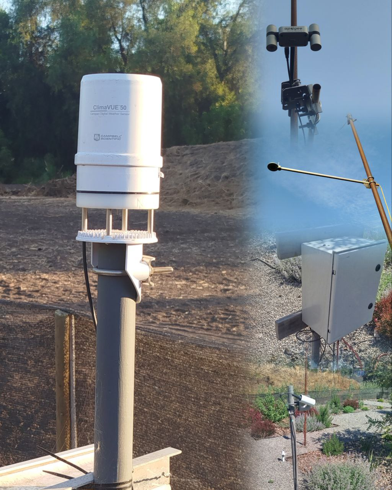
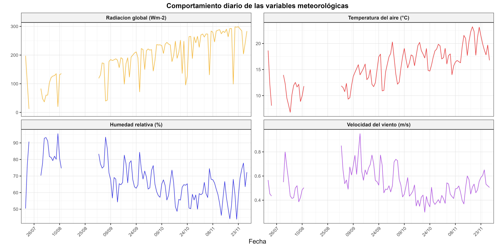
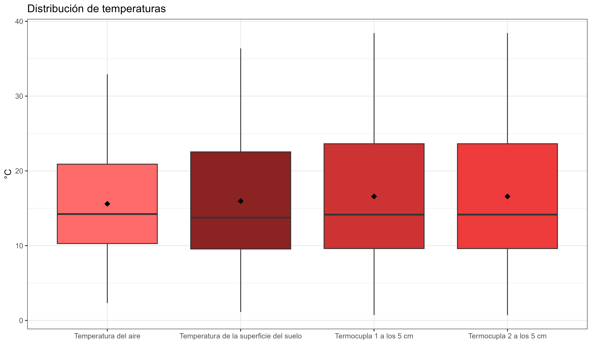
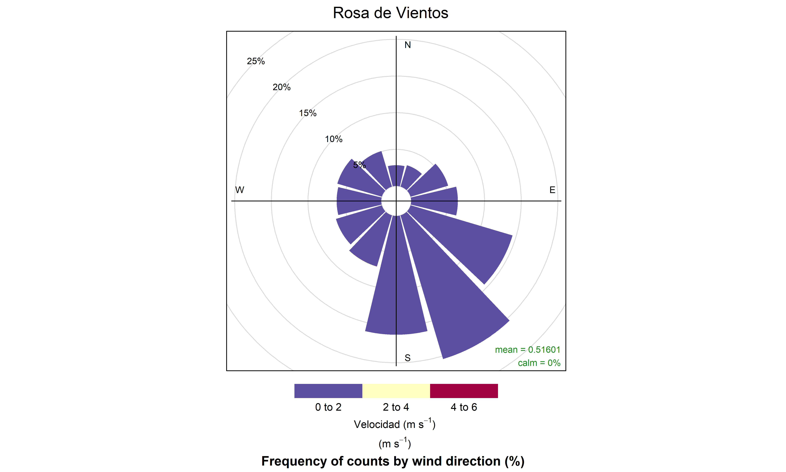

# Evaluación de datos agrometeorológicos

Para un proyecto de investigación se instaló una estación meteorológica automática compacta y una serie de sensores que miden los flujos de energia dentro de una parcela de 1000 m-2, en donde se registran las variables cada 60 minutos dentro de un datalogger CR5000. Por cuestiones de seguridad, los datos se descargan semanalmente y estos se van almacenado. El formato de los archivos es ".dat". Para garantizar la integridad y aplicabilidad de los datos, es necesario adjuntarlos de forma secuencial y posteriormente, verificar la calidad.

En este repositorio se encuentran los procedimientos llevados a cabo para procesar los datos meteorologicos registrados; una exploración que integra estadística descriptiva y visualización gráfica, además de aplicar principios metodologicos para detectar la calidad de los mismos.



***Objetivo***

Evaluar la utilidad de registros meteorologicos a través de un conjunto de procesamiento, visualización y control de calidad de datos.

## Procesamiento de los datos

### Paqueterías utilizadas

Se usa el entorno de RStudio y los siguientes paquetes: `here`, `readxl`, `dplyr`, `ggplot2`, `tidyr`, `lubridate`, `patchwork`, `summarytools`, `officer`, `flextable`, `scales`, `tidyverse`, `lubridate`, `readr` y `writexl`.

### Variables agrometeorológicas registradas

-   Temperatura (°C)

-   Humedad relativa (%)

-   Velocidad del viento (m/s)

-   Dirección del viento (°)

-   Presión atmosférica (mbar)

-   Radiación global (Wm-2)

-   Precipitación (mm)

-   Temperatura superficial (°C)

-   Flujo de energía en el suelo (Wm-2)

-   Radiación Neta (Wm-2)

-   Temperatura termocupla 1 (°C)

-   Temperatura termocupla 2 (°C)

-   Humedad del suelo a los 5 cm (m3/m3)

-   Humedad del suelo a los 40 cm (m3/m3)

## Estructura del repositorio

``` text
├── README.md
├── 01_importar_datos/
│   ├── datos_crudos/        
│   ├── script_importacion.R  
│   └── datos_consolidados/    
├── 02_analisis_control_calidad/
│   ├── script_analisis_exploratorio.R   
│   ├── script_control_calidad.R
│   ├── datos_procesados/   
├── 03_visualizacion_grafica/
    ├── script_visualizacion.R 
    └── graficos/ 
```

## Pasos para utilizar el repositorio

```         
1. Ejecutar 01_importar_datos/script_importacion.R
2. Ejecutar 02_analisis_control_calidad/script_analisis_exploratorio.R
            02_analisis_control_calidad/script_control_calidad.R
3. Ejecutar 03_visualizacion_grafica/script_visualizacion.R
```

## Basamento teórico

El control de calidad de datos meteorológicos debe seguir una serie de pasos que pueden ser diferentes dependiendo de la variable a evaluar, su naturaleza e inclusive la escala de medición. Por ejemplo, debido a la elevada variabilidad temporal y espacial de la precipitación, es muy difícil determinar cuándo un valor registrado de esta variable es atípico, pero es lógico asumir que no pueden existir valores negativos en el registro. Por otro lado, la detección de tendencias es fundamental, siempre y cuando los registros sean sumamente largos, que abarquen múltiples periodos estacionales y años, esto mismo es aplicable a los test de homogeneidad. Por ende, para el procesamiento de los datos registrados para este repositorio solo se decidió utilizar algunos criterios de control de calidad aplicables a los datos disponibles hasta la fecha de inicio del procesamiento.

### Análisis exploratorio de datos

Se calcularon estadísticos básicos, tales como; media, mediana, desviación estándar, minimo, máximo, cantidad de NA, número total de datos y completitud.

### Control de calidad

1)  Verificación de rangos físicos plausibles: Se definieron y evaluaron límites físicos para cada variable, contabilizando todos los valores que se encontraron fuera de estos intervalos.

2)  Detección de valores atípicos estadísticos: Se utilizó el método del rango intercuartílico (IQR) para identificar observaciones atípicas en variables clave, calculando el número y porcentaje de estos valores que se desviaron significativamente de la distribución central. Este principio no se aplicó a la precipitación.

3)  Evaluación de la completitud: Se calculó el porcentaje de datos no faltantes para las variables esenciales, lo que permitió identificar cuáles pudieron tener problemas de disponibilidad.

4)  Control de la continuidad temporal: Se detectaron saltos en la serie temporal identificando intervalos entre registros consecutivos que no fueron de una hora, lo que ayudó a encontrar huecos o inconsistencias en la frecuencia del muestreo.

### Visualización

Para la visualización se construyeron gráficos de líneas para las variables más representativas; radiación global, temperatura del aire, humedad relativa, velocidad del viento y humedades del suelo. Por otro lado, para las temperaturas del aire, de la superficie del suelo, y las registradas por las termocuplas a 5 cm de profundidad se realizaron gráficos de caja y bigote. Para la precipitación se decidió utilizar un gráfico de barras.  Por último, el grafico de rosas de viento se utilizó como el más ideal para mostrar la dirección del viento predominante.

## Resultados

Debido a la cantidad de variables, se muestran solo algunos resultados:

#### Análisis exploratorio

| Variable | Media | Mediana | Desviación | Mínimo | Máximo | N_NA | N_Total | Completitud (%) |
|--------|--------|--------|--------|--------|--------|--------|--------|--------|
| **Radiación Global** (W/m²) | 189.109 | 10.835 | 261.701 | 0 | 873 | 0 | 2438 | 100 |
| **Precipitación** (mm) | 0.029 | 0 | 0.273 | 0 | 6.035 | 4 | 2438 | 99.8 |
| **Rayos** (conteo) | 0.003 | 0 | 0.084 | 0 | 3 | 4 | 2438 | 99.8 |
| **Velocidad Viento** (m/s) | 0.516 | 0.458 | 0.345 | 0.048 | 2.103 | 4 | 2438 | 99.8 |
| **Dirección Viento** (grados) | 176.130 | 163.900 | 79.516 | 0.900 | 359.700 | 4 | 2438 | 99.8 |

#### Control de calidad

| Variable | Límite Inferior | Límite Superior | Valores Fuera de Rango | \% Fuera Rango | Valores NA | \% NA | Media | Estado |
|:-------|:------:|:------:|:------:|:------:|:------:|:------:|:------:|:------:|
| **Temperatura del Aire** (°C) | -10 | 45 | 0 | 0% | 4 | 0.16% | 15.59 | OK |
| **Humedad Relativa** (%) | 0 | 100 | 0 | 0% | 4 | 0.16% | 67.62 | OK |
| **Velocidad del Viento** (m/s) | 0 | 50 | 0 | 0% | 4 | 0.16% | 0.52 | OK |
| **Radiación Global** (W/m²) | 0 | 1500 | 0 | 0% | 0 | 0% | 189.11 | OK |
| **Precipitación** (mm) | 0 | 100 | 0 | 0% | 4 | 0.16% | 0.03 | OK |

La visualización gráfica permitió ver el comportamiento típico de las variables; la radiación global y la temperatura fueron aumentando a medida que se pasaba de la estación de invierno a primavera. Por el contrario, la humedad relativa y la velocidad del viento fueron disminuyendo.



Las temperaturas no mostraron valores atipicos y fuera de rango



La rosa de vientos mostró la dirección Sur como la más frencuente.



## Conclusiones

La evaluación de los registros en relación al comportamiento esperado y al cumplimiento de los aspectos del control de calidad confirman la suficiente calidad de los datos para su aprovechamiento en estudios posteriores. Es importante mencionar que existe un margen de tiempo no registrado, especialmente durante agosto de 2025. Este margen no se tomó en cuenta para el análisis, debido a que varios sensores estaban en fase de instalación.

## Agradecimientos 

La Agencia Nacional de Investigación y Desarrollo de Chile (ANID) apoya esta investigación a través del proyecto Fondecyt Regular ID 20968

## Referencias

Llanos Herrera, L. (2013). RClimTool: Manual del usuario [PDF]. Centro Internacional de Agricultura Tropical (CIAT) - Ministerio de Agricultura y Desarrollo Rural (MADR) de Colombia. Recuperado de www.aclimatecolombia.org

Dandrifosse, S., Jago, A., Huart, J. P., Michaud, V., Planchon, V., & Rosillon, D. (2024). Automatic quality control of weather data for timely decisions in agriculture. Smart Agricultural Technology, 8, 100445. <https://doi.org/10.1016/j.atech.2024.100445>

## Declaración de uso de inteligencia artificial generativa

El autor recurrió a la herramienta Deppseek <https://chat.deepseek.com/> para el apoyo y corrección de algunos scripts que se utilizaron en el procesamiento de los datos.

## Autor

Ing. Msc Miguel I. Silva B.

Doctorado en Cs de la Agricultura y la Naturaleza

Pontificia Universidad Católica de Chile

Fecha: Diciembre, 2025
